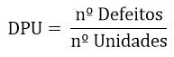
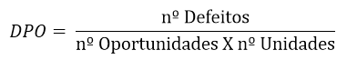
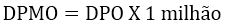
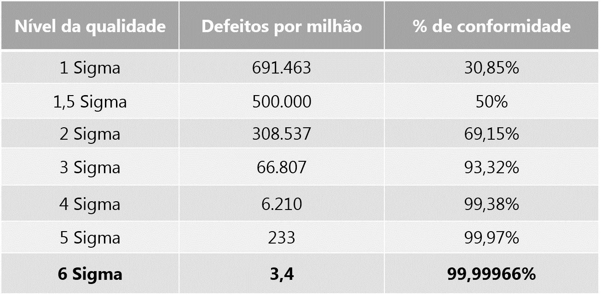

##### LABORATÓRIO<!--Obrigatorio-->
[KPIS](#) | [LEAN SIX SIGMA](#) | [QUALIDADADE](#) 

 
 

 

<strong>WAGNER TORRES IT Especialist</strong> | 12 Out 2022 
[)](https://github.com/wstorres) 

---

 
 

<h2 align="center"> Métricas de Qualidade Lean Six Sigma </h2>

### KPI’s e Métricas Seis Sigma

Veja agora as 4 métricas Seis Sigma, como elas se relacionam e porque são fundamentais nessa metodologia!

Você sabe o que são KPI´s e métricas Seis Sigma? Pode parecer complicado, mas o conceito é bem simples. KPI´s são indicadores, e métricas são sistemas de mensuração que indicam uma determinada tendência.

Agora que você entende o significado desses termos, você certamente irá compreender as métricas Seis Sigma, pois são elas que nos ajudam a observar e a medir o resultado dos nossos processos.

Dessa forma, conseguimos comparar nossos resultados com o de outras empresas. Também podemos medir se estamos bem ou não em relação ao que seria o ideal e se os resultados estão dentro das especificações definidas pelo cliente ou pela empresa.

Dentro da metodologia Seis Sigma teremos métricas fundamentais para avaliarmos nossos processo, que são:

- Defeitos por Unidade (DPU);
- Defeitos por Oportunidade (DPO);
- Defeito por milhão de oportunidade (DPMO);
- Nível Sigma de qualidade;
- Diferença entre defeito e defeituoso;
- Exercício para você praticar.
- Também utilizamos dentro desses indicadores algumas definições, como a diferença de um produto com defeito para um produto defeituoso, assim como a definição do que é CPOQ.

Vamos falar mais sobre esses indicadores e esses conceitos?

Mas antes de te explicar, veja essa dica de ouro!
Confira agora o nosso KIT de Templates incríveis de KPI's para gestores, onde você receberá 3 templates para analisar e apresentar os KPI's da sua empresa.

Com esses templates planejados especialmente para você se organizar e se sentir motivado com os seus projetos, é possível definir, gerenciar e analisar painéis, conteúdos e atividades para atingir outro patamar em seus negócios empresariais.

Não perca essa oportunidade de ouro e baixe agora!

Templates incriveis de KPIs para gestores

1. Defeitos por Unidade (DPU)
O DPU são os defeitos por unidade. Ou seja, por meio dessa métrica, à medida que vamos produzindo um produto ou serviço, nós conseguimos entender se ele possui algum defeito, e caso a resposta seja afirmativa, quantos defeitos ele possui.

Imagine a seguinte situação: você tem na sua mão um formulário de pesquisa. Esse formulário tem alguns campos para você preencher onde você precisa marcar qual a sua opção, e outros campos, como por exemplo, um campo para comentário.

Dessa forma, esse formulário pode conter alguns defeitos como erros de preenchimento e dentre esses erros, poderíamos identificar alguns mais usuais, os quais seriam: deixar de marcar uma resposta, marcar duas respostas para a mesma pergunta ou fazer um comentário no local errado.

Portanto, o DPU é um indicador de extrema valia, pois diz quantos defeitos seu produto possui. Isso permite que você possa analisar se seus números são aceitáveis ou se precisa haver uma melhora.

Podemos calcular os DPUs da seguinte maneira:

2. Defeitos por Oportunidade (DPO)
DPO são defeitos por oportunidade. Possui um conceito um pouco diferente de DPU, porque o que eu tenho que avaliar aqui é quantas oportunidades de defeitos eu tenho.

Continuando a usar o exemplo do formulário, você teria que pensar algo do tipo: quantas oportunidades de erros de preenchimento você tem nesse formulário?

Imagine que existam 3 oportunidades, as quais são: a pessoa deixar de marcar uma resposta, marcar mais de uma resposta para a mesma pergunta ou fazer um comentário no local errado.

Temos a seguinte fórmula para encontrar os DPOs:

3. Defeito por milhão de oportunidades (DPMO)
O DPMO, defeito por milhão de oportunidades, é apenas uma forma diferente de ver o indicador DPO. A diferença é que aqui você vai multiplicar por um milhão.

Isso é muito usual porque muitas vezes estamos analisando uma empresa, uma fábrica, uma linha de produção de grande volume. Assim, é comum fazermos essa medição de contagem de defeitos, e essa medição ser feita em termos da ordem de grandeza de um milhão.

Geralmente as pessoas que trabalham com esse indicador falam da seguinte forma: eu possuo 20 defeitos por milhão ou 20 PPM, que seriam 20 partes por milhão.

4. Nível de qualidade Sigma
Chegamos enfim ao nível de qualidade Sigma! Esse nível sigma é uma forma que nós temos de avaliar a qualidade do processo.

No cálculo do nível Sigma você deve avaliar quantos defeitos ou quantos defeitos por oportunidade seu processo possui e traduzir isso para um nível de qualidade dentro da escala do nível Sigma.

Reparou que a escala está em defeitos por milhão? É exatamente por isso que o DPMO tem uma forte relação com o nível de qualidade Sigma!

Ao encontrar os DPMOs, você pode avaliar seu resultado observando essa tabela. Assim, você saberá em qual nível de qualidade Sigma está seu processo, se é preciso melhorar ou se está satisfatório!

5. Diferença entre defeito e defeituoso
Em meio ao estudo desses indicadores, é importante ressaltar que existe uma diferença entre defeito e produto defeituoso. Vamos a eles?

Defeito: defeitos são falhas que você consegue medir na sua unidade de produto. Voltando ao exemplo do formulário... De forma simples, defeitos seriam os erros de preenchimento, pois são possíveis de se contar.
Defeituoso: Defeituoso é qualquer unidade de produto que possui um ou mais defeitos. Remetendo ao nosso exemplo, se seu formulário tem um ou dois erros de preenchimento, cada erro desse é um defeito. A partir do momento que esse formulário possuir um ou mais defeitos, você pode classificá-lo como um produto defeituoso.
Ficou claro a diferença? É muito importante entender essa diferença, porque normalmente nas ferramentas estatísticas medimos essas duas coisas separadamente.

Uma coisa é quantos itens defeituosos você tem, por exemplo, cinco formulários defeituosos. Porém cada formulário pode ter um ou mais defeitos, ou seja, um ou mais erros de preenchimento.

Então, à vezes nesses cinco formulários defeituosos, você pode ter 10, 15 ou 20 defeitos. Assim, você deve fazer essa contagem para que possa fazer a medição de forma separada.

6. COPQ (Cost of Poor Quality)
O custo da falta de qualidade se refere ao valor que você perde por não ter um bom nível de qualidade. Está relacionado a todas as perdas que você tem quando não se preocupa em como o seu processo está fluindo.

Por exemplo, imagine que você produz 100 mil garrafas de agua por dia, porém 30 mil são defeituosas, ou seja, você não pode vender. O custo dessas 30 mil garrafas é esse custo pela falta de qualidade, o custo de estar produzindo defeitos, utilizando um processo que não é otimizado, que não é estabilizado.

---

