##### LABORATÓRIO<!--Obrigatorio-->
[WHITE BELT](#) | [LEAN SIX SIGMA](#) | [PROJETOS](#) 

 
 

 

<strong>WAGNER TORRES IT Especialist</strong> | 12 Out 2022 
[)](https://github.com/wstorres) 

---

 
 

<h2 align="center">White Belt Six Sigma</h2>

## O que Lean Six Sigma
O Lean Seis Sigma, ou Lean Six Sigma (do inglês) é uma das metodologias mais famosas e requisitadas no mundo dos negócios, por ser muito eficiente na otimização de processos produtivos. Ela é responsável por aumentar a produtividade e reduzir a **variabilidade** na criação de produtos e na prestação de serviços.

**A variabilidade dentro do concepção da metodologia** - determina, em linhas gerais, o quanto algo varia. O termo 6 sigma é uma referência a uma meta particular de se reduzir o número de defeitos para próximo de zero. Sigma é a letra grega que os estatísticos utilizam para representar o desvio padrão de uma população.

Contudo, o que a maioria das pessoas não sabem é que o Lean Seis Sigma é a união de duas outras metodologias: o Seis Sigma e o Lean Manufacturing. Se você quer entender melhor como tudo isso funciona, confira abaixo os tópicos que abordaremos neste artigo:

### Como Surgiu

Apesar de que o Seis Sigma surgiu antes do Lean, suas aplicações se deram em períodos semelhantes. Diante disso, foi inevitável que os consultores das metodologias percebessem a sinergia que ambas compartilhavam. 

O principal foco do Seis Sigma é melhorar a qualidade dos processos, ou seja, amplificar os pontos fortes já existentes. Enquanto isso, o principal foco do Lean é a redução dos desperdícios durante um processo, ou seja, minimizar os pontos fracos. 

Dessa forma, as duas metodologias juntas visam melhorar o que já é bom e reduzir o que ainda é empecilho, formando assim uma dupla imbatível que visa a melhoria contínua. 

Vale ressaltar ainda que o Lean Seis Sigma é uma metodologia muito versátil, que pode ser aplicada em diferentes áreas,como de
produtos e serviços
, visando atingir os objetivos personalizados da mesma, o que torna ele ainda mais eficiente. 

Hoje,
o Lean Seis Sigma se ampliou exponencialmente
e vem alcançado resultados muito satisfatórios nas instituições que sua implementação foi feita. Mas, você sabe quais são as percepções para o futuro dessa metodologia? 

Não deixe de conferir o próximo tópico para saber mais sobre isso! 

### O que é Six Sigma?
O Six Sigma é uma metodologia que busca reduzir a variabilidade nos processos produtivos. Dessa forma, é possível aumentar a qualidade do produto e evitar desperdícios durante a sua produção. Esse mecanismo ganhou notoriedade ao ser implementado na General Eletric por Jack Welch (CEO da época) e gerar bons resultados financeiros.

Diferente do que muitos pensam, o Six Sigma não é apenas uma ferramenta que busca a adequação das empresas às normas da qualidade. O foco dessa metodologia está diretamente ligado à **satisfação do cliente.** Um projeto Six Sigma atua na otimização de processos. Dessa forma, é possível produzir produtos mais padronizados, estáveis e, consequentemente, de maior qualidade.

### O que é Lean Manufacturing?
O Lean Manufacturing, cuja tradução é **manufatura enxuta**, é uma filosofia operacional que envolve a análise e redução dos 8 desperdícios Lean na linha de produção. Em outras palavras, essa metodologia visa a eliminação de processos e atividades que não agregam valor para o cliente final.

**manufatura enxuta** dentro da conecpção do metodologia, tem como os objetivos básicos reduzir os desperdícios do sistema de produção, ter maior qualidade dos produtos, diminuir o tempo de entrega dos produtos aos clientes, com menor número de defeitos e, ainda, estabelecer um processo de inovação incremental contínuo.

Por meio da redução de desperdícios e do aumento na eficiência produtiva dos processos, o Lean Manufacturing consegue uma redução significativa no tempo entre o pedido do cliente e a entrega (Lead Time), o que resulta em uma diminuição nos custos da empresa. Além disso, essa metodologia faz uso do conceito de melhoria contínua e da aplicação das 7 ferramentas da qualidade.

### Sixs Sigma x Lean Manufacturing

Em resumo, a metodologia Seis Sigma busca **__reduzir a variabilidade nos processos produtivos e eliminar os defeitos__**, aproximando-se dos 99,99966% de perfeição. Enquanto isso, o Lean Manufacturing tem como objetivo o **__aumento da eficiência produtiva, que pode ser alcançado por meio da eliminação dos 8 desperdícios Lean.__** Para que você compreenda a diferença entre essas duas metodologias, observe a imagem abaixo.

### As 6 principais ferramentos do Lean Seis Sigma

Sabe-se que grande parte das empresas utilizam o Lean Six Sigma. Porém, quais são os principais mecanismos utilizados durante o processo de implementação dessa metodologia? É sobre isso que falaremos neste tópico. Separamos e detalhamos as 5 principais ferramentas do Lean Six Sigma. Confira abaixo!

#### 1. SIPOC:

O SIPOCé um diagrama que busca encontrar o escopo de um trabalho, por meio da definição do principal processo que será otimizado durante um projeto. No Lean Six Sigma, essa ferramenta costuma ser utilizada durante a fase de “define” do método DMAIC.

Como visto na imagem acima, o SIPOC é um acrônimo em inglês. Cada uma das letras é referente a uma etapa do processo que está sendo analisado, sendo elas:

Suppliers (fornecedores): quem fornece os recursos que serão necessários para o andamento do processo.
Inputs (entradas): recursos e informações que serão transformados/utilizados durante o processo.
Process (processo): atividades que usarão/transformarão os recursos e as informações fornecidas pela etapa anterior
Outputs (saídas): produto de cada processo.
Clients (clientes): quem recebe o produto de um processo.
Se você tiver interesse em entender um pouco mais sobre o SIPOC, você pode assistir a um de nossos vídeos sobre essa ferramenta no YouTube: Como fazer um diagrama SIPOC para mapear processos?

#### 2. Diagrama de Ishikawa (Diagrama de espinha de peixe)
O Diagrama de Ishikawa busca otimizar o processo de identificação da causa raiz do problema em questão. Com essa ferramenta, é possível associar o efeito que será estudado com as suas possíveis causas. Por conta disso, também podemos chamá-lo de Diagrama de Causa e Efeito.

Podemos dividir as possíveis causas de um problema em 6 categorias, sendo elas:

1. Máquina
1. Materiais
1. Mão-de-obra
1. Meio ambiente
1. Medida
1. Método

O Diagrama de Ishikawa é uma ferramenta muito visual e foi desenvolvida no Japão na década de 60 por um engenheiro de controle da qualidade chamado Kaoru Ishikawa. Por ser muito eficiente, tornou-se uma das 7 principais ferramentas da qualidade amplamente utilizadas nas empresas.

Diagrama de Ishikawa

Ficou interessado no tão famoso Diagrama de Espinha de Peixe e quer conhecer as outras ferramentas da qualidade? Assista ao nosso vídeo no YouTube: Descubra as 7 Ferramentas da Qualidade!

#### 3. FMEA
O FMEA (Failure Mode and Effect Analysis) é um mecanismo que permite identificar possíveis falhas e supor quais seriam as consequências caso elas aconteçam. Além disso, essa metodologia pode ser utilizada para identificar quais ações de melhoria possuem maior prioridade e pode ser aplicada tanto em produtos quanto em processos.

#### 4. Kaizen
O termo Kaizen vem do japonês e significa melhoria contínua. Essa filosofia sugere que devemos estar na constante busca por aprimoramento, seja na vida pessoal ou na vida profissional. O Kaizen foi criado com o intuito de alcançar alguns objetivos, sendo eles:

Obtenção de lucro para a empresa.
Cultura participativa dos funcionários.
Melhorias ditadas pela necessidade.
Eliminação de desperdícios.
Proporcionar satisfação aos clientes.

Gostou? Agora, no próximo tópico, entenderemos o Programa 5s.

### 5. Programa 5S
O 5s é um programa focado na qualidade que busca melhorar o ambiente de trabalho e aumentar a produtividade de uma empresa. Essa melhoria se dá com base em 5 sensos, sendo eles:

1. Seiri - senso de utilização.
1. Seiton - senso de organização.
1. Seiso - senso de limpeza.
1. Seiketsu - senso de conservação.
1. Shitsuke - senso de autodisciplina.

### 6. Ciclo DMAIC
O Ciclo DMAIC é uma das principais ferramentas do Lean Seis Sigma. A sigla se refere às etapas: Define (Definir), Measure (Medir), Analyze (Analisar), Improve (Melhorar) e Control (Controlar).

Como as etapas estão presentes em um ciclo, caso o objetivo estabelecido não seja atingido, recomenda-se voltar ao início Ou seja, deve passar por todas as etapas novamente até atingir a melhoria almejada. Veja mais detalhes abaixo:

Define (Definir): nesta etapa é estabelecido o objetivo que se espera do projeto. Recomenda-se a participação de toda equipe;
Measure (Medir): trata-se do levantamento das causas potenciais do problema e do estabelecimento das prioridades segundo uma análise da base de dados;
Analyze (Analisar): diz respeito à identificação das causas raízes (conhecidas como X vitais), que afetam o processo de maneira significativa e provocam variação no resultado de interesse (variável Y);
Improve (Melhorar): indica-se uma solução adequada para implementação através de um Plano de Ação e checa-se impacto e resultados obtidos com as melhorias implementadas;
Control (Controlar): deve-se monitorar os resultados obtidos e estabelecer controles que permitam a sustentabilidade dos resultados.
Compreendidas todas as 65 principais ferramentas do Lean SeisSix Sigma, agora vamos conhecer a hierarquia dos profissionais que atuam dentro dessa metodologia, os belts.

### Para que serve

Quais são os objetivos centrais do Lean Seis Sigma? Entenda para que serve essa metodologia e como ela pode aumentar o lucro da sua empresa!
Amanda Tartarotti 01/04/2022 - 6 min de leitura

O Lean Seis Sigma ganhou espaço no mundo corporativo quando, em 1999, a General Eletric, empresa do ramo de tecnologias médicas, alcançou ganhos de US$ 1,5 bilhões ao implantar essa metodologia. 

Desde então, diversas empresas começaram a se interessar pelo segredo desses ganhos exponenciais e a buscar entender quais os objetivos centrais do Lean Seis Sigma.

Se você ainda não sabe
o que é o Lean Seis Sigma
, entenda que estamos falando sobre a união de duas metodologias que visam otimizar processos: Lean Manufacturing e Seis Sigma.

Nesta leitura, vamos explorar os sete principais objetivos do Lean Seis Sigma e explicar a fundo para que serve essa filosofia de gestão estratégica por meio dos seguintes tópicos:

1. Redução de gastos
2. Aumento de produtividade
3. Eliminação de defeitos
4. Satisfação do cliente
5. Otimização de processos
6. Diminuição da variabilidade
7. Aumento da competitividade
Vamos nessa?

#### 1. Redução de gastos

É certo que, em um mercado tão competitivo, encontrar formas de eliminar defeitos, diminuir custos e, ainda, aumentar a produtividade do negócio se tornaram prioridades para uma boa
gestão em empresas
.

Por isso, o primeiro grande objetivo do Lean Seis Sigma é reduzir gastos durante os processos produtivos e o dia a dia da empresa. 

Nesse sentido, o Lean Manufacturing foca na produção enxuta, ou seja, produzir somente o necessário, evitando possíveis desperdícios e custos desnecessários. 

São combatidos oito desperdícios:

Processamento Impróprio;
Excesso de Produção;
Estoque;
Excesso de Transporte;
Movimentos Desnecessários;
Defeitos e Retrabalho;
Tempo de Espera;
Capital Intelectual.

Veja na prática: 
A linha de produção do McDonald’s é o que permite que seu lanche fast food fique pronto em apenas alguns minutos. Cada ingrediente fica disposto em um lugar estratégico para a montagem do lanche ser ainda mais rápida, garantindo mais vendas, mais lucro e um boost na produtividade.

Desperdícios do Lean Manufacturing
Aqui são eliminados desperdícios de movimentos desnecessários, tempo de espera e excesso de produção. Desta forma o McDonald’s se tornou um negócio lucrativo e uma referência em produção ágil.

Seja o próximo White Belt do mercado!
E se você pudesse iniciar sua capacitação na metodologia tendência do mercado durante seu intervalo entre aulas ou expediente?

A
certificação de White Belt da Voitto
, com 4 horas de duração, tem acreditação internacional e te ajudará a conhecer os princípios mais básicos da melhoria de processos.

Você irá aprender o método DMAIC - Definir, Medir, Analisar, Melhorar (Improve) e Controlar - por meio de teoria e cases e, assim, poderá trazer melhorias à sua área de trabalho. Aprenda a reduzir custos, otimizar processos e esteja apto a participar do nível operacional da aplicação prática dos projetos de melhoria contínua!

#### 2. Aumento de produtividade

Se você busca aumentar a performance do seu negócio, preocupar-se com a produtividade é fundamental. 

Para entregar mais resultados é preciso trabalhar de forma assertiva e estratégica, conceitos que são colocados em prática durante a implementação da filosofia Lean Seis Sigma em uma empresa. Entenda melhor com um case!

Case Biscoitos da Tia
Imagine que a empresa Biscoitos da Tia receba uma encomenda de 500 cookies, para ser feita em um dia. Parece muito trabalho para a equipe de duas cozinheiras, mas o DMAIC é um exemplo de
ferramenta do Lean Seis Sigma
que poderia ajudar nessa situação!!

As cozinheiras devem definir quais serão os sabores do pedido, mensurar os ingredientes necessários para a produção, analisar as receitas e então colocar a mão na massa! 

Após a entrega do pedido, elas devem pensar em melhorias para uma futura encomenda grande como esta e pedir um feedback do cliente, para ter controle da qualidade de seus produtos!

Dessa forma, a produção será muito mais ágil e Biscoitos da Tia vai conseguir atender encomendas para grandes festas. 

#### 3. Eliminação de defeitos

Identificar e eliminar defeitos significa eliminar custos com retrabalho, indenizações de clientes e garantir uma produção mais eficiente.

Por meio da metodologia Lean Seis Sigma, são feitos estudos a fim de entender qual é o nível Seis Sigma de uma empresa, ou seja, qual é a frequência de defeitos relatados no serviço/produto da empresa por milhão, conforme a tabela:

Níveis de Seis Sigma
Quanto maior for o nível Seis Sigma de uma empresa, melhores são os serviços prestados e menor a quantidade de defeitos encontrados. Alcançar o grau 6 sigma é o grande objetivo de uma consultoria de
projetos em Lean Seis Sigma
.

#### 4. Satisfação do cliente

A satisfação do cliente pode ser entendida como uma consequência de um trabalho Lean Six Sigma bem realizado, uma vez que o pensamento
customer centric
faz parte dessa filosofia.

Afinal, o consumidor é o grande interessado no produto de uma empresa e atender as reais necessidades do cliente é o principal objetivo dessa estratégia. 

Aqui, cada etapa é importante, desde o começo do funil de vendas até o contato pós venda, onde é possível colher feedbacks e trazer insights para melhoria de processos.

Por meio do
diagrama de pareto
um profissional green belt pode conduzir uma análise de dados assertiva com relação às principais reclamações que o Serviço de Atendimento ao Cliente (SAC) tem relatado, por exemplo.

#### 5. Otimização de processos

Otimizar processos significa encontrar formas de fazer as rotinas dentro da empresa funcionarem de maneira mais eficiente, em sua melhor versão.

Quando um projeto Lean Seis Sigma é implementado, o primeiro passo é identificar pontos de melhoria, como excesso de falhas, atrasos nos pedidos e gaps internos da organização.

Trabalhando em cima dessas oportunidades, o projeto Lean Seis Sigma irá
otimizar os processos
da empresa, entregando resultados imediatos, como o famoso caso da GE, além de retornos de longo prazo.

#### 6. Diminuição da variabilidade

Realizar o cálculo de
desvio padrão
é um ponto chave para eliminar falhas, uma vez que essa medida de dispersão tem como objetivo mensurar o “erro médio” de um processo. 

Um processo bem padronizado apresenta menor variabilidade nos produtos finais, tendo menores chances de erro e um nível seis sigma mais alto.

Na clássica história do soldadinho de chumbo, o boneco vem com um defeito de fabricação, tornando-o diferente de todos os outros brinquedos. Isso quer dizer que ele fez parte do desvio padrão da fábrica e foi uma variabilidade incomum do processo.

#### 7. Aumento da competitividade

Os passos anteriores são essenciais para aumentar a competitividade de um negócio por meio da metodologia Lean Seis Sigma.

Ao otimizar processos, eliminar falhas, trabalhar em favor da satisfação do cliente e, além disso, reduzir custos operacionais, a empresa se torna muito mais competitiva em relação às suas concorrentes e passa a assumir a liderança do mercado.

Você está buscando assumir a liderança na sua carreira profissional? Então impulse a sua carreira com a certificação mais valorizada do mercado!

Seja você um especialista Master Black Belt!
A metodologia Lean Seis Sigma já demonstrou, ao longo da sua história, a enorme capacidade de redução de custos e desperdícios e otimização dos processos para as grandes empresas.

O conhecimento na metodologia Lean Seis Sigma faz a diferença para as empresas com projetos que impactam verdadeiramente a organização. E você pode conquistar o título que te dá a possibilidade de gerenciar todos esses projetos.

Já imaginou dominar essa metodologia e se tornar um dos profissionais mais requisitados pelo mercado de trabalho? É por isso que a Voitto possui a formação no
Pacote Especialista Master Black Belt
, uma formação completa que engloba todos os níveis do Seis Sigma. 

O Pacote Master Black Belt da Voitto conta com 250 horas de carga horária e foi feito para você que quer se tornar Especialista Master Black Belt em Lean Seis Sigma!

Lembrando que nossas capacitações em Seis Sigma são os únicos cursos online acreditados pelo fórum Six Sigma Brasil, além de possuírem acreditação internacional pelo The Council for Six Sigma Certification, alinhada com o conteúdo recomendado pela ASQ (American Society for Quality) e com a ISO 10353.

###  Como funciona o Seis Sigma?

De uma forma geral, o sistema Seis Sigma funciona por meio da definição de metas e aplicação de projetos específicos para alcançar essas metas. O sucesso do programa vai depender da mobilização e participação de toda a organização.

É importante saber que os projetos serão definidos a partir da estratégia DMAIC (sigla para Definir – Mensurar – Analisar – Incrementar – Controlar), que de uma forma geral, significa:

- #### Definir: 
  >Metas claras para as atividades e as melhorias almejadas. Essas metas serão os novos objetivos estratégicos da sua empresa.

- #### Mensurar: 
  >o sistema existente. Antes de buscar melhorias, é importante entender 100% como acontece atualmente cada etapa dos processos internos da sua empresa. A partir dessa análise, você poderá estabelecer métricas válidas e confiáveis para ajudar a monitorar o progresso rumo às metas definidas no passo anterior.

- #### Analisar: o seu sistema atual. O objetivo desta análise é identificar caminhos para eliminar a lacuna entre os números atuais e as metas definidas anteriormente. Atenção, essa análise deve ser feita fundamentada por dados sólidos e uma análise estatística.
  
- #### Incrementar: 
  >o seu sistema. Isso significa que você vai melhorá-lo, e não realizar mudanças estruturais. Nessa etapa, a sua capacidade criativa para encontrar novas soluções e melhorar os processos é um diferencial importante.

- #### Controlar: 
  >o novo sistema desenvolvido. O objetivo dessa etapa é garantir que a metas alcançadas serão mantidas a longo prazo.

### Gurus do  Six Sigma

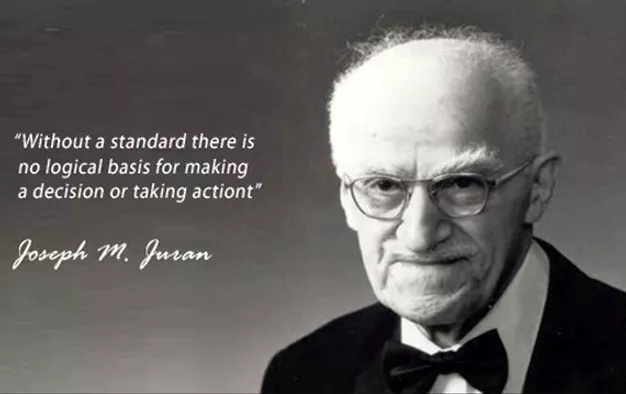

- #### Joseplh M. Juram
"Sem padrão não há base lógica par se tomar uma decisão"

- #### Thaiichi Ohno
"Custos existem para serem eliminados"

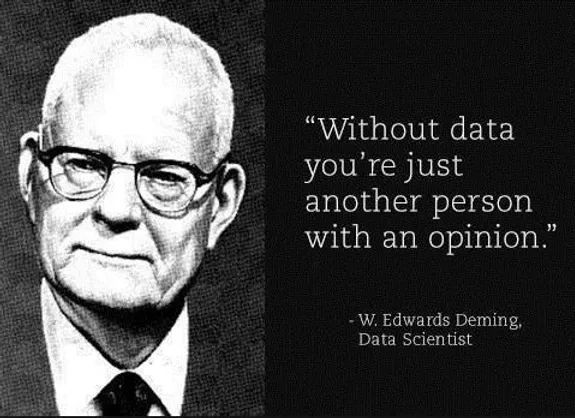

- #### Deming
"Não é preciso mudar. Sobreviver não é obrigatório. Se você não pode descrever aquilo que está fazendo como um processo, você não sabe o que está fazendo."    

<!--(Obrigatorio)-->

### Quais as certificações do Lean Seis Sigma?
Para que uma empresa consiga implantar o Lean Seis Sigma, é necessário que todos os seus colaboradores entendam esse mecanismo. Contudo, funcionários que estão no nível operacional não precisam dominar essa metodologia no mesmo nível que as pessoas que ocupam cargos gerenciais. Diante disso, foram criados os belts.

Cada belt corresponde a um nível e a um grau de envolvimento com os projetos Lean Seis Sigma. Dentre eles, temos:

- White Belt
- Yellow Belt
- Green Belt
- Black Belt
- Master Black Belt (MBB)

Se você quer entender como funcionam as certificações do Lean Seis Sigma, observe os subtópicos abaixo.

##### 1. White Belt
A certificação White Belt em Lean Seis Sigma é recomendada para aqueles profissionais que executam ações rotineiras e operacionais. Dessa forma, é possível que eles ofereçam suporte em projetos Seis Sigma aos funcionários de nível Yellow, Green ou Black Belt.

##### 1. Yellow Belt
A certificação Yellow Belt em Lean Seis Sigma é recomendada para profissionais que possuem nível tático e atuam prestando suporte aos Green e Black Belts. Esse tipo de profissional não possui tanto aprofundamento na metodologia, mas possuem o conhecimento necessário para utilizar algumas das principais ferramentas do Lean Seis Sigma. Devido a isso, estão aptos a desenvolver pequenos projetos de melhoria em sua área de atuação.

##### 1. Green Belt
A certificação Green Belt em Lean Seis Sigma é recomendada para administradores e engenheiros que atuam a nível de supervisão. Possuem um maior domínio da metodologia e dedicam de 20 a 30% do seu tempo a ações de melhoria contínua e a implementação de projetos Lean Seis Sigma.

##### 1. Black Belt
A certificação Black Belt em Lean Seis Sigma  é recomendada para os profissionais que possuem cargos de liderança dentro da hierarquia de uma empresa. Eles respondem diretamente, ou indiretamente, ao MBB e dedicam 100% de seu tempo à implementação do programa Lean Seis Sigma.

### Como aplicar o Lean Seis Sigma?

Neste tópico, traremos um exemplo prático que ilustrará como aplicar o Lean Seis Sigma em uma empresa. Para isso, vamos supor que você trabalhe em uma cervejaria e que a linha de produção pela qual você é responsável engarrafe cervejas do tipo Pilsen em garrafas de 600 ml.

Além disso, levaremos em consideração os seguintes pontos:

As garrafas devem apresentar uma variação de volume menor que 10%. 
A sua linha de produção engarrafa 1.000 garrafas por minuto.
Dessas 1.000 unidades, em média, 4% se encontra fora do limite de variação de volume (10%).
Diante dessas informações, a nossa situação problema é a seguinte:

Em ritmo de fim de ano, um dos principais clientes da cervejaria fez um pedido maior do que o de costume e, para atendê-lo, você precisará aumentar o volume da sua linha de produção de 1.000 unidades por minuto para 1.030 unidades por minuto.

Nesse cenário, como o Lean SeisSigma pode ser útil?

Ao invés de engarrafar uma unidade a cada 0,060 segundos, você terá de fazer esse mesmo processo em 0,058 segundos. Para isso, utilizaremos algumas ferramentas do Lean Manufacturing que serão responsáveis por identificar os 8 tipos de desperdícios na linha de produção e eliminá-los. Dessa forma, será possível aumentar a eficiência produtiva da cervejaria.

Porém, além de produzir mais, temos que manter o nível de variabilidade do processo dentro do aceitável. É nesse momento que utilizaremos a metodologia Seis Sigma e a sua principal ferramenta, o método DMAIC. Sendo assim, conseguiremos manter a qualidade do produto e reduzir a variabilidade do processo produtivo.

Se você compreendeu como aplicar o Lean Seis Sigma em uma empresa e quer ser capaz de fazer o mesmo, eu tenho um convite para te fazer!

### Matrix de Exforço X Impactop

A Matriz de Esforço X Impacto é uma ferramenta para priorização de tarefas. Ela divide os afazeres em 4 grupos, classificando-os de acordo com o impacto gerado e o esforço despendido.

Sua origem não é totalmente certa, mas costuma ser bastante utilizada no Lean Six Sigma. Já os principais objetivos desse modelo de análise são gerar consciência sobre a utilização do tempo e planejar a execução de projetos.

O formato da Matriz de Esforço X Impacto é bastante semelhante ao de outras metodologias utilizadas na gestão de tempo, como a matriz urgente e importante. No entanto, sua abordagem simples e direta pode ajudar a trazer ainda mais clareza na execução das atividades.

A matriz é dividida em dois eixos, vertical e horizontal. O primeiro, que trata do impacto, leva em conta fatores como lucro, vendas e satisfação do cliente. Já o segundo, esforço, considera o tempo, energia, dinheiro ou recursos humanos que serão empregados na tarefa.

Matriz de Esforço X Impacto
Como funcionam os quadrantes da Matriz de Esforço X Impacto?
Apesar de serem bastante intuitivos, os quadrantes da Matriz de Esforço X Impacto podem ser analisados mais de perto para aumentar a compreensão. Acompanhe!

Quadrante I
Traz as tarefas produtivas, já que são aqueles que geram mais resultados com menor esforço. Essas ações devem ser executadas imediatamente, o máximo que a empresa puder — sempre que possível, faça pelo menos uma delas diariamente. Além de trazer recompensas rápidas, o primeiro quadrante ajuda a estimular a equipe.

Quadrante II
Essas ações também são importantes, mas têm difícil execução. Elas exigem disciplina, melhorias constantes e paciência. Por isso, devem ser tratadas com cuidado. Nesse caso, vale a pena investir tempo para planejar como as ações serão executadas, pois isso facilitará todo o processo.

Quadrante III
Tarefas do terceiro quadrante não são completamente inúteis, mas são um tanto perigosas. Por exigirem pouco esforço, costumam ser atrativas. O problema é que os resultados gerados também são baixos.

Então, esteja sempre atento a esse grupo e pergunte-se se esses afazeres são realmente necessários. Caso sejam, reserve períodos curtos de tempo para fazê-los — por exemplo, quando a equipe estiver cansada de tarefas maiores.

Quadrante IV
Além de possivelmente nocivo para a saúde financeira da empresa, o quarto quadrante é desestimulante, pois faz com que as equipes gastem sua energia sem ver qualquer tipo de resultado. Caso alguma dessas tarefas seja realmente necessária, procure maneiras mais criativas e divertidas de fazê-la.

Quais são os principais benefícios da aplicação dessa análise?
As principais vantagens de utilizar a Matriz de Esforço X Impacto são as seguintes.

Aumento de resultados
A grande vantagem dessa ferramenta é entender como gerar ganhos rápidos, otimizando tempo e recursos para maximizar a produtividade. Em outras palavras, a equipe passa a gerar mais resultados com menos esforços, o que é o sonho de toda empresa.

Foco e clareza
A matriz aponta rapidamente em quais tarefas uma equipe ou profissional deve se concentrar. Com isso, o foco e a concentração aumentam, trazendo mais produtividade.

Consenso na equipe
A Matriz de Esforço X Impacto pode ser aplicada com a participação dos colaboradores. Com isso, tende a gerar consenso na equipe, estimulando o espírito colaborativo e atuando como um fator de motivação. Afinal, todos ficam mais seguros e conscientes em relação às decisões tomadas.

Você pode se interessar por esses outros conteúdos sobre produtividade e gestão!

5W2H: o que é, vantagens e como aplicar no seu negócio

Matriz Ansoff: como planejar as estratégias empresariais com ela

Diagrama de Ishikawa: o que é, vantagens e como usá-lo

Plano de ação: entenda o que é e como elaborar um para a sua empresa

Entenda como distribuir melhor as responsabilidades com a Matriz RACI

Matriz GUT: saiba o que é, para que serve e como montar a sua

Como aplicar a Matriz de Esforço X Impacto no dia a dia?
Se você não vê a hora de aplicar e medir a relação entre o esforço e o impacto das tarefas da sua empresa, aqui vão algumas dicas para aplicar a matriz no dia a dia. Veja só!

Liste as tarefas
O primeiro passo é listar todas as tarefas que precisam ser feitas. Se você tiver vários projetos na fila e não souber por qual deles começar, pode começar listando os projetos para, depois, desmembrar as tarefas de cada um deles.

Distribua as tarefas nos quadrantes
Essa etapa é autoexplicativa. No entanto, é importante ficar atento aos critérios que caracterizam impacto e esforço. O impacto não necessariamente é o faturamento, já que pode ser o lucro ou até mesmo a satisfação dos consumidores. Já o esforço não é apenas o tempo, mas também o desgaste da equipe, por exemplo.

Além disso, fique atento às urgências. Sabe aquelas tarefas que precisam ser feitas logo, independentemente do que aconteça? Separe-as e identifique em quais quadrantes se encontram. Por vezes, algo que parece inadiável pode não trazer o impacto necessário para ser considerado prioridade.

Analise os padrões atuais
Com as etapas acima, você já conseguirá priorizar tarefas. No entanto, a Matriz de Esforço X Impacto não é utilizada somente para planejar, mas também para trazer consciência à utilização do tempo.

Ao analisar como anda a sua distribuição de afazeres nos 4 quadrantes, será possível tirar boas conclusões. Uma dica, inclusive, é verificar a porcentagem de tempo gasto em cada quadrante.

Inclua novos hábitos
Para ter resultados constantes, não basta utilizar a matriz apenas uma vez e, depois, abandoná-la. O ideal é que, a partir da reflexão e análise geradas, você inclua novos hábitos de sucesso na rotina para que a empresa tenha mais produtividade.

Por exemplo, a equipe pode se reunir a cada semana para montar a matriz e decidir o que é prioritário. Outro hábito possível seria cronometrar as atividades e, após isso, classificá-las em quadrantes para calcular o tempo gasto em cada categoria.

No contexto empresarial, há muitas metodologias e ferramentas que permitem aumentar a produtividade e melhorar a gestão do tempo. Pela sua simplicidade e eficácia, a Matriz de Esforço X Impacto é uma das análises que costuma produzir melhores resultados.

De todo modo, é imprescindível testá-la na prática e aprender aos poucos com a sua utilização, verificando os resultados obtidos pela equipe.

Para continuar otimizando o trabalho do seu time, baixe gratuitamente a nossa central de ferramentas de marketing vendas e gestão!

### 5W2S

O que é 5W2H?
O 5W2H é uma metodologia de sete perguntas-chave que precisam ser respondidas na fase de desenho de um projeto ou plano de ação.

Cada W e cada H representa uma dessas perguntas:

Quais são os 5W2H?

What (o que?): Definição a ação que vai ser executada.
Why (por quê?): Motivos pelos quais a ação precisa ser executada. 
Where (onde?): Locais em que a ação será feita.
When (quando?): Em que momento a ação será executada? Com que prazo?
Who (quem?): Quem serão os responsáveis pela execução da ação?
How (como?): Qual o método usado na execução da ação?
How much (quanto?): Qual o custo do projeto?
Partir dessas respostas e tabulá-las de maneira visual vão facilitar a organização e a compreensão macro dos principais elementos do projeto, melhorando o nível de alinhamento entre os envolvidos, bem como o monitoramento.

Quando usar o 5W2H? Veja os contextos mais adequados
O 5W2H se aplica bem a qualquer cenário em que você precise fazer um plano de ação, ou seja, não há uma aplicação definida para ele. Qualquer iniciativa pode ter seus sete elementos-chave definidos por meio das perguntas do 5W2H. 

Mas é no desdobramento dessas iniciativas em atividades que a metodologia é particularmente útil. São nos planos de ação pequenos e objetivos que a ferramenta se mostra mais eficiente. 

Por isso, o cenário mais comum é que várias planilhas de 5W2H coexistam em um mesmo projeto.

Como aplicar o 5W2H eficientemente
Implementar um plano de ação com o 5W2H é bem simples. Mas para produzir os resultados que se espera é fundamental aplicá-lo corretamente. Para isso, siga as seguintes recomendações:

Aproveite a ação para engajar a equipe, mostrando a construção do plano de ação será benéfica para todos. O brainstorming pode ser uma ótima ferramenta para interagir com o time e coletar as informações necessárias. 
Caso você ainda não esteja utilizando 5W2H para montar seu plano de ação, comece a refletir sobre que atividades podem ser abordadas com esta ferramenta. 
Não caia na vagueza. Detalhe a informação de modo que toda a equipe tenha clareza sobre os pontos, mas mantenha-se objetivo. 
O 5W2H não é uma ferramenta cíclica, como o PDCA. Use-o em projetos que não vão requerer ações posteriores. 
Não se contente com a primeira resposta às perguntas do 5W2H: aborde-as por diferentes ângulos a fim de chegar às melhores respostas.
Como aplicar a metodologia? Exemplo de 5W2H
Vejamos um exemplo da aplicação do 5W2H. 

Imagine uma empresa que tenha como meta a redução de 20% de consumo de energia elétrica. Uma das ações é uma campanha de conscientização dos colaboradores. Vejamos como ficaria o 5W2H dessa iniciativa:

What (o que?): Campanha de comunicação interna sobre o uso consciente da energia elétrica.
Why (por quê?): Houve aumento no consumo de eletricidade, apesar de a empresa seguir com a mesma capacidade produtiva.
Where (onde?): Nas áreas administrativas da organização, mesclando estratégias online e offline.
When (quando?): A partir do próximo mês.
Who (quem?): Líderes setoriais.
How (como será feito?): Cartazes estimulando o uso consciente de recursos como ar condicionado e luz; etiquetas ao lado de interruptores e equipamento lembrando de desligá-los após o uso; palestras de conscientização; e painel da economia: comparativo do consumo dentro do setor administrativo mês a mês.
How much (quanto custa?): O orçamento aprovado para esta campanha é de R$ 1.000 para comunicados online e cartazes em todos os departamentos. 
Como se vê, todas as dúvidas em relação à ação de redução de energia elétrica são sanadas com o 5W2H. Já o quadro desse 5W2H poderia ser assim:

exemplo de 5w2h nas empresas

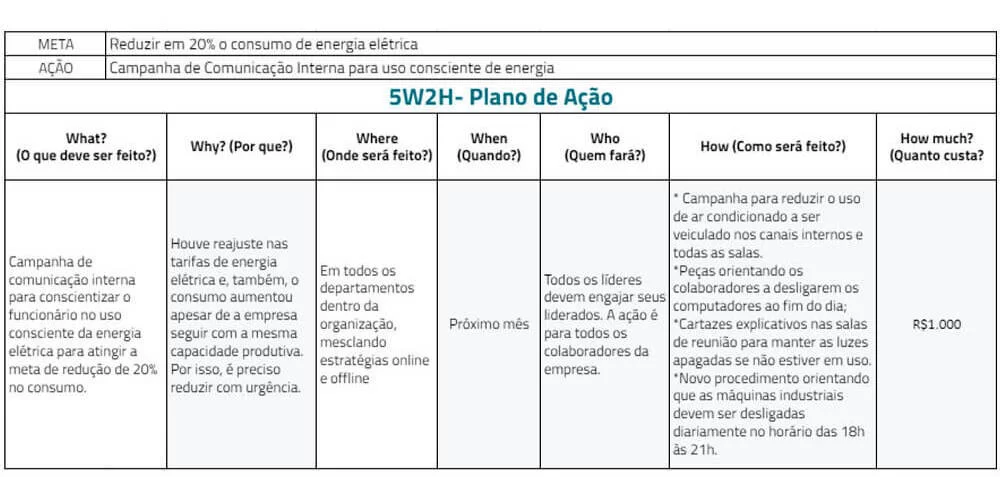

Ferramentas para integrar com o uso do 5W2H
Como tudo que se faz em qualidade, uma ferramenta só ajuda, mas fará muito mais quando utilizada com outras.

Veja que ferramentas vão ajudar você a fazer bons 5W2H:

Diagrama de Ishikawa e 5 porquês
Em muitos casos, dentro da qualidade, você vai usar o 5W2H para endereçar planos de ação de não conformidades ou ocorrências. Contar com ferramentas de descoberta de causa raiz, como o diagrama de Ishikawa e 5 porquês vão ajudar nesse processo.

Matriz GUT
Priorizar planos de ação: a matriz GUT ou matriz de prioridades vai auxilia a definir a ordem de execução dos planos de ação de acordo com a Gravidade, Urgência e Tendência de cada iniciativa.

Brainstorming
Ideias. Quando se trata de responder à pergunta “Como?” do 5W2H, fazer um brainstorming pode ser fundamental para chegar ao melhor método de execução.

Baixe o kit com as melhores ferramentas de gestão da qualidade

Quais são os benefícios do 5W2H?
A ferramenta 5W2H pode trazer vários benefícios para a gestão de planos de ação, como:

Visibilidade: como uma ferramenta de gestão visual, ele dá um panorama do plano de ação;
Alinhamento: a metodologia força a várias definições, deixando pouca margem para dúvidas;
Foco: aumenta o nível de objetividade dos planos de ação; 
Produtividade: a equipe sabe o que fazer, como e quando fazer, podendo agir rápido;
Formalização: montar um 5W2H é uma forma de documentar um plano de ação, fonte à qual sempre se pode retornar. 
5W2H: vários motivos para usar
A ferramenta 5W2H é uma ótima oportunidade para aprimorar a gestão de planos de ação. Responder as sete perguntas é um ponto de partida interessante para visualizar o que está em jogo.

Quando todos trabalham focados para colocar um plano de ação em prática, a ferramenta permite que seu time aumente a capacidade de entrega no prazo estipulado, seja mais produtivo e focado, além de auxiliar no planejamento de recursos.

Utilizar outras ferramentas da qualidade em conjunto com 5W2H permite que você aprofunde as análises para ter uma ação mais assertiva que leve ao alcance do objetivo.

### 8 Despedícios
1. Talento
2. Estoque
3. Movimento
4. Superprodução
5. Transporte
6. Defeito
7. Espera
8. Superprocessamento

### Mapeamento de Processos

O mapeamento consiste em entender e/ou identificar o fluxo de atividades de um processo. Criar um mapa (é daí que surge o termo mapeamento). É um modo de comunicação. Ele tem como objetivo dar auxílio à empresa para que ela possa enxergar os seus processos de negócio, de controle e de apoio. Ou seja, trata-se de uma prática que visa entender as etapas de um processo, descrevendo e relacionando cada uma das pessoas envolvidas, os materiais necessários e os produtos ou serviços resultantes.

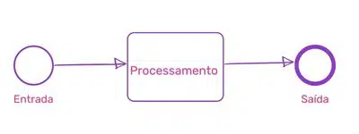

Dessa forma, busca-se um melhor entendimento de cada etapa que compõe o processo, identificando os pontos fracos e fortes com a finalidade de melhorar o desempenho organizacional.

Veja um exemplo:
Vou te mostrar um exemplo apenas, ok? O passo a passo completo está mais adiante neste blogpost.

A sua empresa apresenta uma série de problemas e você não sabe exatamente o que fazer para organizar as atividades e criar padrões de execução de cada tarefa. Pois bem, neste caso o mapeamento te ajudaria muito, pois ele te faria entender como tudo funciona.

Neste exemplo, você reuniria os profissionais envolvidos no processo, faria entrevistas, observaria como cada atividade é realizada e mãos na massa. O próximo passo seria fazer a representação desse fluxo de atividades. Desenhe tudo isso. Eu te indicaria usar a notação de fluxograma ou de BPMN, tanto faz. Vou te mostrar um exemplo de mapeamento de processo de vendas, em notação BPMN:

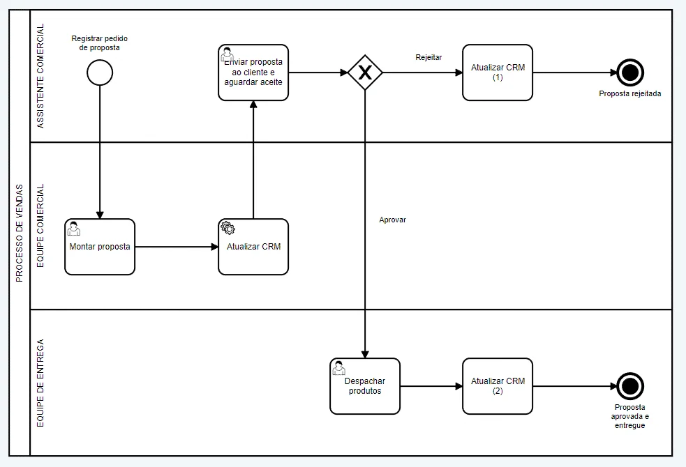

Exemplo de mapeamento de processos
Fluxo do processo
Agora você entende por que eu disse que o mapeamento é uma ferramenta de comunicação? Porque olhando para o desenho acima você consegue identificar o fluxo de tarefas e as atividades que compõe o processo de vendas. E, você consegue ver também se o processo está fluindo de uma forma produtiva ou se ele está dando mil voltas até chegar ao objetivo final, veja o exemplo abaixo:

Exemplo do caminho percorrido pelo processo
O desenho mostra que para eu entregar o mesmo objetivo, a linha roxa percorreu outros caminhos diferentes da linha laranja, certo? Quando você faz um mapeamento você consegue identificar isso: o caminho percorrido pelas atividades (fluxo) do início até a entrega da tarefa, do produto ou do serviço que você deseja entregar.

A linha roxa pode parecer insignificante, mas ela representa mais tempo de execução, mais recurso envolvido, mais pessoas envolvidas e ambas linhas estão chegando ao mesmo objetivo. Agora responda a minha pergunta: fazer o mapeamento é importante? Sim ou com certeza? Vamos melhorar este processo já, mas antes de qualquer coisa você precisa entendê-lo, ou seja, mapeá-lo.

Por que fazer o mapeamento?
Se você leu este post desde o início eu tenho certeza que eu não preciso mais responder esta pergunta, pois já te provei que entender a fundo o seu fluxo de atividades é muito importante. Mas, vou citar (ou salientar) mais alguns motivos:

Melhorar o que é feito;
Documentar as atividades;
Eliminar desperdícios;
Eliminar processos que não geram valor;
Padronizar os fluxos de trabalho;
Automatizar processos;
Reduzir custos;
Reduzir tempo;
E muitos outros…
Quando você inicia o desenho do mapeamento é interessante que você tenha um objetivo em mente para focar nele. Óbvio que você poderá reduzir custo e padronizar atividades ao mesmo tempo, mas quando seu objetivo é agressivo, como por exemplo reduzir custo ou tempo de execução de processo, eu apostaria em uma melhoria por vez. Melhoria contínua é o segredo das empresas produtivas. Claro, a não ser que você esteja inovando e implementando uma ferramenta de gestão de processos, aí sim vai com tudo que a mudança é magnífica e os resultados mais magníficos ainda!

Quando fazer o mapeamento?
Essa pergunta sempre aparece. Talvez, uma das maiores dúvidas de todos os envolvidos: quando fazer o mapeamento? Eu diria que  para definir o momento exato para fazer um mapeamento de processos na sua empresa, você precisa analisar e verificar se a sua empresa está precisando de otimização e melhoria nos processos. Simples assim. Toda vez que você perceber que não está bom, que está havendo ruídos na comunicação, atrasos na entrega ou retrabalhos, está na hora de rever seu processo.

Vale lembrar que isso não significa que você precise rever os processos da empresa inteira. Pode ser apenas o processo em que você trabalha, dentro da sua área ou departamento.

Qual a diferença entre mapa, modelo ou diagrama de processos?
Bom, este é o momento perfeito para eu trazer este assunto. É muito comum as pessoas confundirem estes termos quando querem descobrir processos. Mas, mapas, modelos e diagramas possuem diferentes objetivos.

Quando você utiliza o diagrama, ele serve para retratar os principais elementos do fluxo, simboliza as macro atividades, mas omite os pequenos detalhes. Já o mapa, como eu já te contei aqui neste blogpost, são uma evolução do diagrama, pois demonstra com detalhes o fluxo de atividades (fluxo de trabalho) adicionando eventos, regras e resultados. Desta forma, o mapa permite uma precisão maior no desenho.

Modelo é a versão final com um alto nível de detalhamento que envolve recursos, fluxo de informações, instalações, finanças, etc. e frequentemente é feito mediante ferramentas de simulação.

Quais são os resultados em mapear?
Se você fizer um mapeamento do seu processo você poderá atingir:
Melhoria na compreensão do negócio;
Facilidade de realizar análises;
Redução de custos;
Aumento da produtividade;
Os processos se darão de maneira mais rápida e eficiente;
Resolução de problemas;
Melhores práticas aplicadas;
Padronização;
Organização;
Entre outros!
Nem tudo são flores…
Estava tudo muito fácil até agora, não é mesmo? Sem emoção não tem graça (rsrs). Brincadeiras à parte, como todo e qualquer desafio, você enfrentará algumas dificuldades durante o mapeamento dos processos da sua organização. Eu listei alguns. Veja só:
Escolher a notação que será utilizada no desenho: Fluxograma? BPMN? Alguma outra?;
Escolher a ferramenta mais eficiente: veja algumas dicas para facilitar a sua escolha;
Escolher a equipe que vai ajudá-lo;
Vencer as barreiras: como a resistência, dificuldade de expressão de quem executa o processo, adequação dos processos, falta de visão sistêmica, pouca cooperação dos envolvidos, medo da mudança. Dica: tenha empatia.
Provar para a gestão que mapear processos é uma atividade que agrega valor para a empresa. Leve para a gestão alguns números sobre produtividade que temos neste post, prove que o mapeamento é uma ótima ferramenta de mudança! Se a sua gestão abraçar a ideia, o sucesso é 99,99% garantido.
Essas dificuldades não são regras, tampouco premonições. São dificuldades listadas e baseadas na minha experiência profissional e nos artigos científicos que eu leio relacionados ao assunto. Mas isso não significa que você as terá, ou que todas irão acontecer. Significa apenas que você precisa estar aberto para algumas situações pelas quais precisará estar preparado para passar.

Tá, mas como fazer o mapeamento, afinal?
Em primeiro lugar, lembre-se de que, aqui, a ordem dos fatores altera sim o produto final. Seguir o passo a passo na sequência mostrada é a melhor forma de extrair o máximo possível de informações relevantes e conseguir, assim, melhorar seus processos. Vamos começar?

Mais de 23 mil pessoas já utilizaram este checklist para melhorar os processos da sua organização!
Passo 1: Identificar a questão crítica
Seu objetivo pode ser estabelecer um processo partindo do zero ou mesmo aperfeiçoar um já existente. Em ambos os casos, o primeiro passo é a identificação da questão crítica — um problema real ou mesmo em potencial — que exige uma ação para que não cause impactos ruins nos negócios.

Especialistas afirmam que, após definido o planejamento estratégico, é hora de analisar e identificar fatores que podem impedir que os objetivos sejam alcançados. Assim, será delimitado um cenário no qual as ações deverão ser colocadas em prática para evitar que isso aconteça. Contudo, se a sua empresa não trabalha com um forte planejamento estratégico, a sua questão crítica pode ser, por exemplo:

Resolver problemas recorrentes;
Problemas de comunicação;
Retrabalho, improdutividade;
Pouco crescimento no mercado;
Baixa nas vendas, etc…
O importante é ter bem claro qual o seu problema e, a partir de agora, o foco estará em corrigi-lo.
Passo 2: Selecionar o processo
Após identificada a questão crítica do negócio, deve-se identificar quais processos dentro da organização impactam essa questão e que possuem ação iminente para resolvê-los.

A escolha de qual processo mapear envolve uma série de critérios particulares a cada organização. Nem todos os processos de uma organização podem ser automatizados, por exemplo, e nem todos valem a pena o investimento de tempo e recursos para mapear. Em geral, você deve fazer algumas reflexões:

Esse processo tem impacto em meu negócio?
Esse processo é um problema hoje para minha organização?
Existem oportunidades para que este mapeamento vire um processo automatizado futuramente?
Este mapeamento trará retornos e resultados positivos?
Eu tenho controle, poder de decisão e acesso a todas as informações necessárias para poder mudar como esse processo funciona hoje?
Algumas dicas de bons processos candidatos a mapeamento e automatização:

Processos, procedimentos ou rotinas que se repetem diversas vezes na empresa;
Processos com baixa maturidade tecnológica, que ocorrem por e-mail, planilhas, papel e “conversas no corredor”;
Processos com clientes infelizes;
Processos com alto volume de erros ou inconsistências;
Missão, visão, valores e objetivos da empresa são questões que podem servir de referência para guiar essa etapa do mapeamento. Afinal, é preciso que as ações tomadas sejam justificáveis de acordo com algum parâmetro já estabelecido.

Além dessas dicas, fizemos um blogpost com dicas de como escolher o processo para iniciar o mapeamento.

Como assim?
Para deixar mais claro, vamos pensar que a minha empresa tenha como estratégia tornar-se a líder de mercado em seu segmento. Então, eu identifico que o processo comercial tem um forte impacto nesta estratégia e pode alavancar este sucesso. Pronto! Já sei por onde começar o meu mapeamento: pelo processo comercial.

Uma dica de ouro!
Essa eu só compartilho com quem eu realmente gosto. Se você nunca fez mapeamento de processos, o ideal é que você escolha primeiro um processo pequeno, para aprender com ele. Se você escolher um processo complexo demorará o triplo do tempo e poderá se desmotivar a continuar. 😉

Passo 3: Selecionar a equipe
Por mais eficiente que sejam o gestor e as ferramentas que a empresa possui, qualquer projeto está fadado ao fracasso se não contar com o engajamento dos membros do time. Tanto quanto a capacitação profissional e experiência, é preciso que os funcionários tenham participação ativa nas mudanças propostas.

Por isso, a formação da equipe deve levar em conta o tempo exigido pelo processo e o disponível para ação do colaborador. Entretanto, não basta designar essa tarefa para quaisquer funcionários da empresa. Alguns critérios são extremamente relevantes para garantir o sucesso após o mapeamento.

Alguns exemplos são:

Compreender detalhadamente o processo;
Ter uma visão sistêmica;
Ser criativo;
Ter predisposição e iniciativa;
Saber trabalhar em grupo;
Valorizar a oportunidade de trabalhar no projeto.
O que fazer:
Para começar, é preciso definir um líder — de preferência alguém da alta administração para motivar a equipe e autorizar ações. Lembre-se, sem o apoio da liderança dificilmente as mudanças terão sucesso.

Após a definição do líder, forme um grupo com algumas pessoas que tenham conhecimento em mapeamento ou modelagem de processo, outros que tenham visão de eliminação de desperdícios e implementação de melhorias e nunca esqueça de chamar aqueles que são os mais importantes: as pessoas que executam o processo. Estes se sentirão felizes em participar e pode apostar, eles são fundamentais.

O que não fazer:
Não forme uma equipe e saia mapeando processos sem convidar os usuários daquele processo ou ao menos sem informá-los sobre o que está acontecendo. Transparência é essencial para o sucesso! Se isso acontecer, você pode criar uma resistência muito difícil de ser quebrada. E não há tecnologia ou boa ação que supere a importância da compreensão e comunicação entre pessoas. Confiança é fundamental!

Passo 4: Treinar a equipe
Tão óbvio, mas muitas vezes esquecido. Mesmo que uma empresa conte com profissionais de alto nível e bem capacitados, é preciso garantir que os envolvidos estejam com os conhecimentos alinhados. Por isso, é preciso ter cuidado, pois os erros são comuns em modelagens que ignoram essa etapa. Muitas vezes pode ser necessário, por exemplo, implementar um software específico para a melhoria de um processo. Se sistemas informatizados forem instalados, é preciso treinar os usuários finais e a própria equipe de implementação. Afinal, eles terão de lidar com o software durante todo o percurso.

Indo além, é preciso considerar a possibilidade de oferecer treinamentos para conscientizar os funcionários sobre a relação de interdependência existente em qualquer empresa. Os processos constituem uma complexa rede que se mantém interligada continuamente.

É um fato: todos serão afetados
Não há departamento que não seja afetado por uma falha em processos, mesmo que em menor grau. Os gargalos são o reflexo de impactos diretos em atividades próximas. Ainda assim, os prejuízos não terminam ali. Por isso, os membros dos times devem estar cientes da importância da sinergia entre as áreas e até mesmo conhecer tantos processos realizados por outras equipes quanto for possível.

Lembre-se: treinamentos refletem a valorização do funcionário por parte da empresa. Em relação aos gestores, a capacitação constante permite o aumento de sua autonomia de trabalho em paralelo com novas responsabilidades que assume.

Passo 5: Desenvolver o mapa atual (as is)
Antes de elaborar qualquer planejamento, é preciso compreender exatamente o objeto com o qual lidamos e as atividades que o compõem. Por isso, o desenvolvimento do mapa atual tem como objetivo entender o processo “as is” — ou seja, “como é”.

Recomendo que neste passo, você desenhe o processo, puro e simples. Você irá se preocupar somente em representar visualmente o fluxo de informações de sua empresa.

Estou falando de uma descrição da situação atual, ou seja, como ela acontece hoje e agora. Seu objetivo é tornar claro o cenário em questão, mostrando as dificuldades existentes, os retrabalhos desnecessários que são gerados e os prejuízos que a empresa enfrenta devido a tudo isso. É nesse ponto que você deve ter certos cuidados e um olhar aguçado.

Contenha seu impulso por melhorias
O desenvolvimento do mapa atual é uma etapa de identificação de problemas. Por mais que você se sinta tentado a aplicar diversas soluções que podem surgir ao longo do caminho, é preciso conter esse impulso. Anote o que achar mais relevante para refletir sobre isso futuramente. Tenha em mente que haverá um momento específico para planejar e executar cada solução. Aqui, é preciso focar no detalhamento do processo — uma tarefa que pode ficar por conta do facilitador, um membro que tenha conhecimento do processo de melhoria e dos objetivos em jogo.

O que você entregará ao final dessa etapa
Assim, o resultado esperado é uma representação completa do processo por meio do mapa deste processo — ou seja, um sistema representativo que forneça uma perspectiva desses processos, de ponta a ponta. Um desenho.

E-book gateways
Outra dica de ouro!
Você pode traçar o mapa básico de um processo respondendo apenas QUEM faz O QUÊ. Porém, para um processo bem definido, eu digo que você precisa ir além! Dois itens não são suficientes; há cinco perguntas:

Quem?
O quê?
Quando?
Como?
Onde?
Por quê?
Responder a essas perguntas é essencial para entender o processo e, assim, encontrar maneiras de aprimorá-lo. Por exemplo, se você não for capaz de responder POR QUE o trabalho é feito, é sinal de que o valor do processo não está claro e, nesse caso, sua empresa pode estar desperdiçando tempo com ele.

Passo 6: Identificar as desconexões (problemas)
Entradas e saídas podem constantemente estar desconectadas e isso representa uma falha clara na execução dos processos. É possível que, nesses casos, a equipe encontre desconexões com fluxos redundantes ou mesmo ilógicos — e o maior problema é que eles podem comprometer a eficiência e a eficácia do processo.

Por isso, é essencial que seja feita uma análise ponto a ponto, tarefa por tarefa, etapa por etapa e sem pressa para verificar de que forma as atividades estão sendo realizadas e se há uma lógica clara entre elas. Os pontos de impacto negativo devem ser listados para tratamento futuro — tenha sempre em vista que, eventualmente, a situação pode exigir a eliminação de uma atividade desnecessária ou redundante.

Cuidado!
Eu sei, é muito difícil controlar o impulso de aplicar melhorias, mas, da mesma forma que na elaboração do mapa atual, agora ainda não é hora de implementar soluções! Isso será feito em uma próxima etapa sob o devido monitoramento dos gestores e dos envolvidos no mapeamento do processo.

Passo 7: Analisar as desconexões
A análise dos problemas pode ser feita de diversas maneiras. Muitas empresas tomam como base estudos de especialistas no assunto para implementar técnicas direcionadas a contextos específicos. O Diagrama de Ishikawa (espinha de peixe) é um bom exemplo disso.

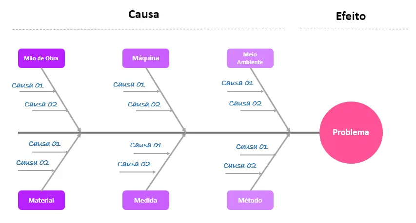

Diagra de Ishikawa
Exemplo de Diagrama de Ishikawa
O objetivo é não só listar os problemas, mas identificar a causa raiz de cada um. Entretanto, é importante destacar que toda a equipe deve estar reunida para essa etapa do processo. Afinal, todos podem contribuir de uma maneira ou de outra.

Outra técnica utilizada com frequência é o brainstorming. Nele, as ideias são dadas com mais espontaneidade — mesmo que pareçam, a princípio, banais. Se um colaborador tem uma sugestão simples, o colega pode complementar. Coletivamente, uma análise mais aprofundada se desenha. Após a identificação das principais causas de desconexões, pode ser aplicado um benchmarking (pesquisa de melhores práticas) com base em ações de outras empresas ou mesmo de modelos internos de sucesso.

Passo 8: Desenvolver o mapa ideal (to be)
Agora sim, a hora que você tanto esperava: melhorar o que está ruim! Com um alicerce robusto de informações em mãos, finalmente é hora de desenvolver o mapa ideal, ou “to be”. O primeiro passo, entretanto, é a definição da amplitude da transformação, conforme mostrado no tópico sobre a identificação da questão crítica. As informações ali levantadas deverão mostrar se o processo deve ser melhorado ou totalmente redesenhado. Porém, a segunda alternativa exige complexas quebras de paradigma nas quais a atividade precisa ser repensada desde o princípio.

Isso pode trazer algumas dificuldades para equipes inexperientes, já que envolve a proposição de um cenário inovador. Tenha em mente que há sempre a possibilidade de seguir linhas distintas e depois comparar os resultados para julgar qual é a melhor opção. Sendo assim, em paralelo, pode ser feito um mapa de relacionamento, para que todas as atividades visam redução de custos, sejam favoráveis à qualidade, ampliem a produtividade, eliminem os problemas e reduzam o desperdício.

Como definir a orientação da melhoria?
Lembre-se: você está fazendo o mapeamento com base na sua questão crítica, ou seja, aquilo que você deseja mudar para melhor. Dessa forma, eu listei 12 itens que ajudam a nortear a busca por eficiência na melhoria dos processos e a pensar em um desenho ideal, ou “to be”. Veja só:

Eliminar a burocracia;
Eliminar a duplicidade;
Avaliar o valor agregado;
Simplificar (ou desburocratizar) o processo;
Reduzir o tempo de ciclo do processo;
Tornar o processo a prova de erros;
Modernizar;
Promover uma linguagem simples;
Padronizar;
Realizar parcerias com fornecedores;
Aperfeiçoar o quadro geral;
Automatizar.
Sim, são ações simples, mas que causam um impacto extremamente positivo e facilitam bastante a busca por melhoria nos processos.
Como ter ideias para melhorias?
De onde surgirão as ideias e a fonte de inspiração? Bom, uma alternativa é o próprio benchmarking, que não serve apenas para avaliar comparativamente os processos, mas também para ser uma fonte de inspiração. Não é porque os outros fazem que você vai ser menos criativo. Tenha em mente que aquilo que é bom e funciona deve ser copiado, no sentido positivo. Não precisamos inventar a roda toda vez que vamos fazer uma melhoria, não é verdade?

No entanto, não é preciso sempre olhar para fora. Se você quiser descobrir como melhorar seus processos, o input das pessoas que executam esses processos — chamadas, no BPM, de atores dos processos — será muito valioso. Elas têm contato direto com o fluxo de trabalho e, possivelmente, já tiveram várias ideias para modificar aspectos problemáticos ou falhos. E você não precisa apenas ouvir o que elas têm a dizer. Em vez disso, pode estimulá-las a ter ideias e, também, colaborar com sua própria criatividade. Uma boa maneira de fazer isso é promovendo sessões de brainstorming (chuva de ideias), com a finalidade de levantar alternativas para resolver os problemas identificados nos processos de negócio.

Passo 9: Estabelecer medidas de controle
Qualquer mudança estrutural deve ser acompanhada de indicadores que permitam o monitoramento daquilo que está sendo feito. Caso contrário, o melhor dos planejamentos pode se tornar uma armadilha para uma equipe que não consegue alcançar seus objetivos, já que é criada uma expectativa que não será atendida.

O ideal é que a equipe estabeleça as medidas e os objetivos dos processos e dos subprocessos, começando pelo que diz respeito ao cliente final. Isso pode ser estabelecido em quatro níveis: a meta a ser atingida, um meio para monitorar, uma estratégia de comparação entre real e objetivo (gráfico) e um procedimento para corrigir desvios.

Os indicadores chave de desempenho (KPI), por sua vez, não podem ser deixados de lado. Eles são fundamentais para expor necessidades de aperfeiçoamento, uma ferramenta básica de gestão. Por isso, devem estar diretamente relacionados aos objetivos da empresa, seus valores e ideais. Não é por acaso que constantemente um indicativo de desvio nos remete rapidamente a uma possibilidade de ação pontual para ajuste fino.

Passo 10: Implantar e monitorar
Não basta estabelecer metas e, após implementá-las, abandonar o projeto. Adotar uma cultura inovadora significa buscar melhoria contínua, já que essa é a melhor forma de otimizar seus processos e de evitar que eles voltem a apresentar falhas. Por isso, as palavras de ordem são: implantar e monitorar.

Para começar, o plano de ação deve ser executado. Questões como o nível de criticidade e o estado atual do processo deverão influenciar no tempo estimado para adaptação — quanto menos maturidade ele tiver, maior o período de implantação. Se possível, é importante que as mudanças adotadas estejam detalhadamente registradas como procedimentos ou instruções de trabalho. Afinal, dali para a frente, esse será o novo guia de atuação dos profissionais envolvidos.

Planilha de plano de ação
Por fim, divulgue as novas responsabilidades, os objetivos e as metas para que haja uma mudança comportamental na empresa — ou seja, para que a cultura inovadora se sustente. Lembre-se de ter cuidado ao lidar com as pessoas para que todos se mantenham engajados nas mudanças e correspondam às expectativas.

Depois de mapear, você pode (e deve) automatizar
A automatização significa colocar o seu processo “To be” dentro de uma plataforma de BPMS. A transformação digital nos oferece ferramentas cada vez mais eficientes e os benefícios dessa mudança são muitos. Afinal, os erros de processos são reduzidos, a qualidade tende a crescer e o próprio tempo é melhor aproveitado.  

Você quer descobrir como isso tudo ocorre na prática, desde a escolha do processo até a automatização? Buscar por este conhecimento já é um passo incrível. Mas, você precisa colocar em prática. É possível ir do zero à automatização de processos, você mesmo pode fazer isso.

Conheça uma ferramenta fantástica
Falando em fazer automatização de processos de maneira simples e prática, eu não posso deixar de compartilhar com você uma ferramenta, o Zeev. O Zeev é uma ferramenta low-code que vai ajudar você a eliminar a dor de cabeça do dia a dia da sua empresa, ou do seu departamento, por meio da padronização dos fluxos de trabalho.

Por isso, vou indicar a você um texto excelente: O melhor software de processos que você vai conhecer. A tecnologia é e sempre vai ser o seu maior aliado na otimização de processos. E lembre-se, você vai mapear o processo e depois? O segundo passo é automatizá-lo, caso contrário, o mapeamento vai ficar pegando teia de aranha na gaveta.

O grande pulo do gato é que você mesmo pode mapear, desenhar e automatizar o seu processo, de forma muito simples, em alguns cliques, sem precisar conhecimentos específicos de TI ou programação. Dessa forma, enquanto você realiza o mapeamento do processo chave, de grande impacto, sua empresa pode ir se beneficiando dos demais fluxos de trabalho. Nada mal, não é mesmo?!

Boas práticas para documentação de processos
Viabilizar o sucesso desse procedimento exige eficiência na documentação dos processos. Por isso, vou destacar aqui as boas práticas das quais você não pode abrir mão antes, durante e depois do mapeamento.

Não desviar da cadeia de valor
A definição da cadeia de valor de qualquer atividade representa a sua espinha dorsal. Ignorar seu funcionamento pode comprometer totalmente o trabalho realizado. Por isso, ela deve ser estudada e definida como um fluxo de atividades a ser reconhecido durante qualquer etapa dos processos.

Não foque apenas em departamentos
Como destaquei, a integração entre áreas é fundamental para a eficiência desse tipo de mudança estrutural. Por isso, não desenvolva um trabalho unicamente individual dentro de cada departamento. Invista na sinergia entre áreas.

Entenda os objetivos
A documentação tem como principal referência os objetivos da empresa. Trata-se de um mecanismo que deve estar diretamente ligado a eles, já que visa guiar os funcionários na direção certa. Por isso, estude e compreenda profundamente os objetivos e as metas derivadas dele.

Escolha indicadores relevantes
Indicadores são essenciais para o monitoramento, mas podem complicar o trabalho do gestor se não oferecerem informações relevantes. O ideal é que haja KPIs específicos e que sejam claros. Desvios nunca devem levantar apenas uma dúvida, mas alertar sobre uma demanda real de melhoria.

Registre oportunidades
Mesmo que o processo tenha sido alterado para melhor, oportunidades de melhoria podem surgir ao longo do caminho. Documentá-las é a melhor forma de garantir que o futuro da empresa não seja estagnado em um modelo preconcebido como perfeito. Faça das novas ideias as melhorias do futuro.

Use ferramentas adequadas
Existem diversos softwares e plataformas para acompanhar essa fase de mudança. Não abra mão do uso desse tipo de ferramenta, pois o trabalho pode ser muito mais complicado que o necessário sem elas. O ideal é contar com um sistema fácil e intuitivo, que otimize seu trabalho sem torná-lo apenas mais burocrático. Conheça o Zeev.

BPMN Compliance
Existe um ditado que diz que “o papel aceita tudo”. Isso se aplica ao desenho de processo, também. Quando estamos desenhando um processo para fins de documentação, para treinamento, para “colar na parede”, podemos desenhar o processo como bem entendermos. Podemos usar elementos para fins diferentes, podemos desenhar conexões inválidas. Desde, é claro, que nosso público-alvo consiga entender o desenho.

Quando estamos desenhando para fins de automatização, entretanto, o público-alvo é a ferramenta de automatização. Por exemplo, é o motor do Zeev que deve entender primeiro o desenho, para poder executá-lo. Portanto, o desenho do processo deve ser BPMN compliance. BPMN compliance significa que o processo deve ser semanticamente correto e seguir a especificação.

Por último, mas não menos importante: não faça mapeamentos que duram meses!
Erro comum em muitas organizações, por isso, não o cometa! Essa é a hora de pensar estrategicamente. Isso significa que é preciso analisar o mercado, ser ágil e implementar ações de melhoria o mais rápido possível. Busque resultados satisfatórios, pense nas pessoas e, principalmente, em facilitar o trabalho delas, no dia a dia. Modificar a maneira como o processo funciona pode trazer grandes resultados.

Criar atividades para aprimorar o atendimento ao cliente e eliminar atividades que não geram valor para o seu negócio serão só alguns dos benefícios. Gargalos não detectados, desperdícios, procedimentos não documentados e fluxos de informações confusos não existirão mais na sua organização!

Mãos à obra!
Agora você já sabe o que é e qual a importância do mapeamento de processos. Chegou a hora de você colocar a mão na massa! Com o auxílio desse passo a passo, o mapeamento de processos pode ser feito com tranquilidade e sem desafios maiores do que o necessário. 

Em pouco tempo, você poderá colher os frutos e fazer com que a dinâmica de sua empresa se torne ainda melhor. O mercado atual apresenta uma competitividade muito alta e uma cultura inovadora é a melhor forma de conquistar diferenciais em relação à concorrência!

### DMAIC
O que é DMAIC?

Você sabe o que significa DMAIC? A sigla DMAIC significa Definir, Medir, Analisar, Melhorar (Improve, em inglês) e Controlar, o que resumidamente explicita o que o uso da metodologia desenvolve nos processos.

Ele é um roteiro de 5 etapas, elaborado a partir da metodologia Lean Six Sigma, que ajuda as empresas a utilizar a análise dos dados da gestão em prol das tomadas de decisões.

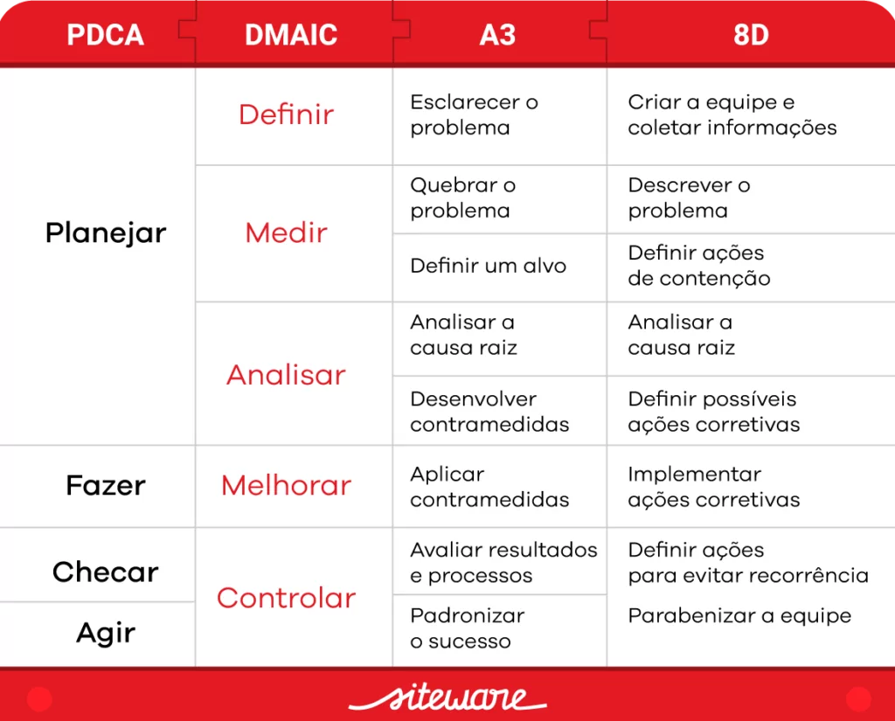

Os principais objetivos da metodologia DMAIC são:
Melhorar os processos e impulsionar a gestão de qualidade da empresa;
Focar constantemente no aprimoramento das atividades e dos produtos;
Levar a empresa a alcançar maior sucesso e destaque;
Entregar serviços cada vez melhores para os consumidores;
Utilizar ao máximo seus recursos disponíveis.
Esse método tem utilidades e procedimentos em comum com alguns dos quais já falamos aqui no blog, como o Ciclo PDCA e o A3. Cada uma dessas metodologias pode ser usada isoladamente ou sendo complementares, dependendo do objetivo da organização e de suas particularidades.

Clareza da estratégia
Quadro comparativo de metodologias: entenda cada uma!
o que é ciclo dmaic
Mas como desenvolver o ciclo DMAIC com sua equipe? Siga as etapas elaboradas a partir da Metodologia Seis Sigma!

Etapas do DMAIC
1ª etapa: Definir
Forme o time que irá trabalhar no projeto, selecionando pessoas especializadas em diferentes áreas para que vários pontos de vista possam ser utilizados;
Selecione os problemas de forma objetiva;
Foque nos projetos mais relevantes e viáveis;
Pense nas melhorias que podem ser feitas.
Para auxiliar nessa etapa, o método de Brainstorming e a análise dos KPIs da empresa podem ser utilizados.

2ª etapa: Medir
Avaliar o desempenho do processo e analisar quantitativamente antes de aplicar ações (para que o desempenho seja comparado antes e depois);
Coletar dados e informações sobre os processos;
Levantar as possíveis causas dos problemas.
Para auxiliar nesta etapa, alguns métodos podem ser utilizados, como o Diagrama de Ishikawa (Espinha de Peixe); Análise de Pareto e Matrizes (como a de Causa e Efeito, GUT ou RAB).

Diagrama de Ishikawa
3ª etapa: Analisar
Pense nas causas raiz dos problemas que afetam a gestão;
Analise as melhores formas de contra-atacar essas causas;
Crie oportunidades de melhoria.
Para auxiliar essa etapa, o método dos 5 Porquês pode ser utilizado para identificar as causas raízes.

4ª Etapa: Melhorar
Teste previamente possíveis ações, tendo em vista seus prós e contras;
Execute o plano de ação de acordo com as necessidades específicas de cada processo;
Implemente as mudanças.
Para auxiliar essa etapa, o método 5W2H pode ser utilizado.

5ª Etapa: Controlar
Monitore o desenvolvimento do plano de ação para que ele não se perca;
Estabeleça critérios de controle (check-lists, estatísticas);
Analise o desempenho geral dos retornos (financeiros ou não) do processo;
Atualize os procedimentos para uma melhoria contínua, de acordo com as necessidades que forem surgindo.
Para auxiliar essa etapa, os métodos de Cartas de Controle e OCAP podem ser utilizados.

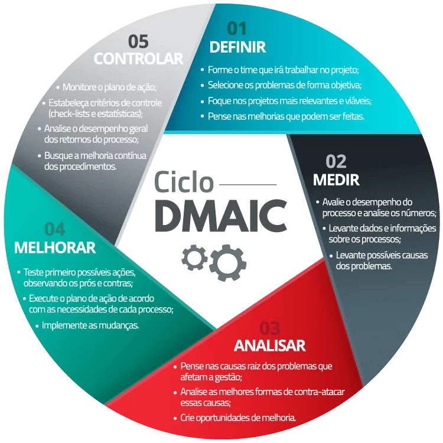

o que é DMAIC
Conclusão sobre o que é DMAIC
Para que o Ciclo DMAIC seja bem utilizado, é importante que todos os colaboradores envolvidos no processo tenham um bom treinamento, estejam preparados e alinhados aos tipos de mudanças propostas. Um ambiente horizontal e democrático é essencial para que as atividades evoluam e tenham o apoio de todos.

Desenvolver o engajamento da equipe com a empresa, com seus valores e com o desejo de melhorar tanto seu desempenho pessoal como o de todos os processos é fundamental para que o planejamento seja bem-sucedido. Lembre-se: sua equipe é a chave para o sucesso de qualquer tipo de negócio!

Essas informações sobre o que é DMAIC foram esclarecedoras para você? Saiba mais sobre outros métodos de gestão de qualidade acompanhando nosso blog!

O STRATWs One é um software para execução da sua estratégia que conta com todas as ferramentas da qualidade que permitem o sucesso de sua operação.

### 5 POR QUÊS

O que é a técnica dos 5 porquês 
Conhecida também como 5-Why, a metodologia dos “5 porquês” foi idealizada em 1950 pelo arquiteto do sistema Toyota de produção, Taiichi Ohno. A técnica é muito utilizada para resolução de problemas internos, principalmente por conta da sua eficiência e simplicidade. 

Essa ferramenta consiste em chegar à raiz do problema com a repetição da pergunta “Por quê?”. Para a identificação da causa, o método exige interatividade e investigação, a fim de que seja encontrado o que realmente causou o problema. 

Ao encontrar o motivo da adversidade, é possível tomar ações eficientes que eliminem o problema, evitando o investimento em ações ineficientes.  

Dessa forma, a técnica pode ser usada em qualquer situação que for necessário investigar um problema para encontrar uma solução.  

Em suas etapas, a ferramenta consegue determinar:  

O que aconteceu; 
Porque aconteceu; 
O que fazer para evitar a probabilidade de acontecer novamente. 
Por que e quando utilizar os 5 porquês 
A ferramenta 5 porquês, surgiu para auxiliar a gestão de qualidade e otimização de processos, pois facilita na procura da melhor solução para um problema. Pois, ela foca na causa do ocorrido, evitando e eliminando falhas nas próximas demandas.  

O foco dessa metodologia é fazer com que o time reflita sobre as falhas de maneira aprofundada. Assim, a equipe se torna mais unida e alinhada, o que é fundamental para o desenvolvimento de uma organização.   

A técnica dos 5 porquês pode ser utilizada em reuniões de brainstorming, quando surge um problema mais complexo, já que o ponto de vista de diferentes pessoas ajuda a chegar em diferentes respostas para o mesmo ocorrido.  

Como aplicar a técnica dos 5 porquês  
Se um problema reaparece repetidamente, e sempre há tempo e capital desperdiçados, é hora de utilizar essa técnica. Já que são esses conflitos que aparecem frequentemente que precisam ser analisados de maneira mais minuciosa.  

Apesar de ser uma metodologia simples, é necessário se atentar a alguns pontos para executá-la adequadamente. Para isso, é recomentado seguir 2 passos principais:  

Passo 1: Identificação do problema  
Essa etapa consiste em reconhecer o problema, os principais afetados e envolvidos, e depois agendar uma reunião para discutir o assunto.  

Para o sucesso da técnica, é importante a interação das pessoas que vivenciou e sentiu o problema em foco. 

Durante esse processo é indicado definir um mediador para facilitar a dinâmica da discussão.  

Passo 2:  Pergunte “Por quê?” 
Na reunião agendada é o momento de colocar em prática a técnica dos 5 Porquês. Entretanto, antes de iniciar é necessário alinhar o problema com todos os participantes, para que todos compreendam o que está acontecendo.  

Logo em seguida, as perguntas podem ser iniciadas. Nessa etapa é importante seguir as seguintes dicas:  

Lembrar que todos os participantes precisam ser honestos e sinceros; 
Explicar como a técnica funciona.  
Após as explicações, o mediador pergunta aos colaboradores o porquê do acontecido. A pergunta deve ser objetiva, para que os envolvidos consigam captar a mensagem. Apesar da pergunta ser simples, as respostas requerem reflexão, é importante buscar dados e fatos.  

Assim que uma resposta de um porquê for dada, deve-se perguntar novamente o “por quê”. Pois, é essa associação de perguntar e responder os “porquês” que leva a raiz do problema.  

Sendo assim, as perguntas devem ter relação com a resposta do “por quê” anterior, para a consistência das respostas. Normalmente, o questionamento dos “porquês” é repetido cinco vezes, mas não é uma regra.  

Exemplo de aplicação dessa técnica 
Problema: Um artigo não foi entregue no prazo. 

Por quê? Porque o responsável não conseguiu escrever; 
Por quê? Porque existia outras demandas como prioridade; 
Por quê? Porque surgiram demandas de urgência; 
Por quê? Porque o colaborador era o único que conseguia resolver; 
Por quê? Porque a equipe é reduzida e surgiu muitas demandas, atrasando a entrega do artigo. 
Contramedida: Contratar um novo funcionário para auxiliar com as demandas.  

Os 5 Porquês e outras ferramentas  
A metodologia dos 5 porquês pode ser utilizada com outras ferramentas de análise de causa, em cenários que pedem uma investigação mais minuciosa.  

Uma delas é o Diagrama de Ishikawa, nessa situação é recomendado aplicar o diagrama primeiro, enumerando os fatores que podem ter levado a adversidade.  

Logo em seguida, aplica-se a técnica dos 5 Porquês considerando as respostas dos pontos que foram foco do Ishikawa.  

Elabore um plano de ação  
Ao chegar na origem do problema é a hora de elaborar um plano de ação para evitar que se repita. Já que, não adianta entender a causa e não a tratar, concorda?  

Para isso, podemos utilizar a ferramenta 5W2H, que auxilia na construção do plano de ação e mantém a produtividade do time em foco.  

Enfim, a ferramenta dos cinco porquês explora a causa e efeito de erros cometidos dentro de uma empresa, a fim de que encontre a origem dele e o resolva. 

Agora que você já entendeu como funciona o método dos 5 porquês e como aplicar, que tal começar a rever os processos que falham dentro da sua organização? 

Para tornar seu planejamento ainda mais eficiente e organizado, você pode baixar agora a nossa planilha grátis sobre plano de ação para te auxiliar nesse processo!

#### Poka Yoke

Aprenda a prevenir problemas com a utilização do Poka Yoke na sua empresa!
Compreenda a importância de soluções preventivas e confira como funcionam os dispositivos Poka-Yoke para começar a aplicar ainda hoje!

Thiago Coutinho
Por: Thiago Coutinho
Publicado em 01/10/2020 | Atualizado há 9 meses | 8 min de leitura
Aprenda a prevenir problemas com a utilização do Poka Yoke na sua empresa!
Nome engraçado, não é mesmo? Mas saiba que o Poka Yoke veio para corrigir um "problema" típico de muitas empresas.

Por muito tempo, ações corretivas foram empregadas no ambiente corporativo como a melhor alternativa para gerenciar uma área e empresa.

Elas não necessitavam de quaisquer investimentos - financeiros e qualitativos - e, apesar de na maioria das vezes trazerem prejuízos, ainda não acarretavam a falência de um negócio.

Entretanto, desde a propagação do Sistema Toyota de Produção, do Lean Manufacturing e do Controle da Qualidade Total (TQC) nos anos 70, a aderência de práticas e de ações preventivas veio sendo cada vez mais adotada para uma empresa manter-se em um mercado continuamente mais competitivo.

Nem preciso salientar que, nos dias atuais, gerenciar uma organização através de ações corretivas deixou de ser adequado, certo? Hoje, atuar de forma preventiva ao surgimento de problemas e oportunidades de melhoria de desempenho é crucial para manter sustentável o crescimento e o progresso de uma organização.

Por isso, nesse artigo você irá aprender:

O que é Poka Yoke?
Quais são os tipos de Poka Yoke?
Como fazer um Poka Yoke?
Aplicações do Poka Yoke no dia a dia
Acompanhe!

O que é Poka Yoke?
Poka Yoke é uma ferramenta enxuta representada por simples dispositivos e/ou procedimentos que possuem como missão inicial prevenir o surgimento de erros em um processo produtivo através da eliminação de suas causas geradoras.

Quando o ataque à causa do erro ainda não é possível ou conveniente, ao menos a detecção de sua origem é efetuada com o propósito de conter a obtenção de defeitos nos produtos processados.

Lembrando que o Poka Yoke é uma ferramenta que tem como base o sistema Lean Manufacturing. Portanto, nada melhor do que se aprofundar nos conceitos desse sistema e aprender aplicar os princípios Lean e identificar desperdícios dentro da sua empresa.

Antes de continuarmos com a leitura do artigo, tenho algo para te mostrar...
Nós da Voitto preparamos um presente especial e gratuito para você! Baixe agora nosso Ebook Lean Manufacturing de A a Z, e aprenda tudo sobre essa poderosa ferramenta focada em redução de desperdícios.

Com esse ebook você aprenderá quais são os tipos de desperdícios existentes, quais as métricas Lean, quais as ferramentas de melhoria, como adotar o Lean Manufacturing na sua empresa e muito mais!

Gostou? Clique logo abaixo para fazer o download!

Ebook do Lean Manufacturing de A a Z

Agora, é importante compreender que o Poka Yoke é parte de uma cultura que deve ser compreendida e aplicada nas organizações: a cultura de prevenção! A seguir você entenderá melhor a sua importância e como ela deve ser estimulada para que bons resultados sejam alcançados.

Cultura de Prevenção: compreenda a sua importância!   
A prevenção de problemas não ocorre do dia pra noite. Ela deve ser estimulada diariamente como um processo cultural em que cada problema manifestado em um processo deve ser encarado como umaoportunidade de melhoria, pela qual através de sua resolução perante o ataque a sua causa raiz, seu regresso seja posteriormente contido ou eliminado.

Uma cultura de prevenção de problemas é uma das exigências primordiais para o funcionamento do sistema Lean Manufacturing, já que processos autônomos exigem menores intervenções humanas e, consequentemente, uma menor probabilidade de erro operacional. É nesse princípio que o Poka Yoke se baseia!

Erros e Defeitos: qual deles combater?
A relação de causa e efeito é idêntica à relação de erro e defeito, quer ver só?

Um erro indica uma falha no processo que pode gerar, em seguida, um ou mais defeitos no produto, se não for previamente resolvido.

Ou seja, é então para combater as causas do erro que Shigeo Shingo, um dos engenheiros da Toyota nos anos 60, desenvolveu a ferramenta que faz parte da produção enxuta Poka Yoke - que significa à prova de erros.

Quais são os tipos de Poka Yoke?
Existem 4 modalidades do método Poka Yoke que são amplamente utilizados em processos de produção para evitar erros, sendo elas:

Prevenção
Detecção
Valor fixo
Etapas.
Vamos ver cada uma delas de maneira mais aprofundada?

Poka Yoke de Prevenção
O Poka Yoke de prevenção é a primeira modalidade proposta para aplicação. Seu objetivo é eliminar de vez a causa geradora do erro, que pode estar ligada a inúmeras possibilidades.

Algumas delas são:

Falta de treinamento operacional.
Excesso de atividades manuais.
Alta rotatividade de operários em uma linha de produção.
Ambiente de trabalho desorganizado.
Condições operacionais inadequadas.
Exemplos de Poka Yoke de prevenção
Os Poka Yokes de prevenção podem ser comparados a um pen drive que possui uma ranhura específica de forma que o encaixe ocorra somente do lado correto, a um verificador automático de ortografia e gramática de um processador de texto, a moldes de produção destinados ao encaixe de peças exclusivas, e por aí vai.

Poka Yoke de Detecção
O Poka Yoke de detecção conta com duas modalidades propostas para aplicação: a de controle e a de advertência.

O método de controle tem como finalidade interromper o processo perante a ocorrência de um erro operacional, obrigando sua resolução imediata por meio do combate a sua causa raiz.

Já o Poka Yoke de advertência possui como objetivo advertir por meio de sinais visuais e/ou auditivos o surgimento do erro, informando aos operários sobre sua origem de modo que uma prévia análise de contenção seja realizada.

Exemplos de Poka Yoke de detecção
Os Poka Yokes de detecção podem ser relacionados a um disjuntor, por exemplo, que tem como função interromper a transmissão de energia perante sobrecargas elétricas.

A uma campainha comercial deixada acima no balcão para assegurar que a entrada de novos clientes seja percebida e até ao indicador de gasolina representado por uma luz vermelha mais intensa no painel do carro quando o tanque entra na reserva.

Poka Yoke de Valor fixo
O Poka Yoke de Valor fixo serve para assegurar que um número específico de movimentos tenha sido feito durante o processo.

Exemplo de Poka Yoke de Valor fixo
Separação de peças para montagem. Dessa forma, se sobram peças na bandeja, significa que alguma montagem foi feita de maneira incorreta.

Poka Yoke de Etapas
O Poka Yoke de Etapas evita falhas na ordem de execução. Ele determina se todos os passos de uma operação estão sendo seguidos na ordem correta. Se não for feito nas etapas certas, não será possível realizar a operação desejada.

Exemplo de Poka Yoke de Etapas
Um exemplo clássico presente na rotina diária de todas as pessoas é sacar dinheiro no caixa eletrônico. Você precisa seguir uma série de etapas como colocar o cartão, retirar o cartão, utilizar a biometria, dentre outras, para só ao final receber o dinheiro, caso siga as etapas corretamente.

Como fazer um Poka Yoke?
Elaborar um Poka Yoke é fundamental para prevenir erros e tornar uma produção enxuta. Então, para te auxiliar nesse processo, vou lhe mostrar as 5 etapas para elaboração de um bom Poka Yoke.

1 - Definição
Criar a equipe, sempre incluindo aqueles que trabalham diretamente com o processo
Kaizenblitz é uma atividade de equipe muito efetiva para esse tipo de tarefa
Se o processo exato a ser melhorado ainda não estiver definido, realizar o Mapeamento do Fluxo de Valor (VSM)
Descrever o problema.
2 - Medição
Através do mapeamento do processo, identificar a etapa que pode estar originando o defeito
Analisar o problema com ferramentas como o Diagrama de Ishikawa para chegar a sua causa raiz.
3 - Análise
Criar o Procedimento Operacional Padrão do processo
Testar o POP em campo
Identificar os erros que podem ocorrer e originar o defeito.
4 - Melhoria
Definir o tipo de Poka Yoke a ser utilizado: o de controle é mais indicado, pois elimina a necessidade do fator humano
Realizar sessões de brainstorming em equipe para gerar ideias de dispositivos Poka Yoke ou procedimentos que possam eliminar ou detectar o erro. É preciso lembrar sempre que o Poka Yoke deve ser o mais simples e barato possível
Testar as soluções encontradas, tentando fazer com que falhe e definir a melhor opção.
5 - Controle
Implementar a solução encontrada em larga escala dentro da organização
Treinar pessoal na sua utilização
Criar um padrão para Poka Yoke com: problema a ser solucionado, ação em caso de emergência, método e frequência de checagem da operação, método de checagem da qualidade em caso de parada
Monitorar se os defeitos diminuíram desde a implementação da ferramenta.
Seguindo essas 5 etapas, com certeza você conseguirá elaborar seu Poka Yoke de maneira eficiente, tornando seu processo bem mais enxuto e à prova de erros!

Aplicações do Poka Yoke no dia a dia
Talvez você esteja pensando que só lida com Poka Yoke quem está ativamente participando em processos industriais, mas isso não é verdade.

Essa ferramenta está muito mais presente nas suas atividades do que você imagina, e vou lhe provar isso agora.

<img src="./img/poka-yoke-aplic.png"

Viu só? Várias atividades comuns utilizam essa técnica à prova de erros, e tenho certeza que somos muito beneficiados através dela.

Afinal, já pensou se não existissem as janelas de segurança perguntando se desejamos salvar o documento antes de fechar? Quantas vezes teríamos perdido textos importantes, não é mesmo?

### Fábricas ocultas

engenharia dimensional, GD&T
Fábricas ocultas são todas as atividades que resultam na redução da qualidade ou eficiência de um processo ou departamento. Essas atividades NÃO são essencialmente conhecidas e gerenciadas pelas áreas de planejamento e engenharia de uma organização.

Quem já presenciou aquela montagem que só ocorre com o auxílio de uma lixa ou outra ferramenta manual?! Essas tarefas acabam tornando a execução dos processos de manufatura demoradas, onerosas e extremamente dependentes desses recursos.

Para que tenhamos processos de manufatura cada vez mais versáteis e capazes de entregar melhores produtos, precisamos assumir e gerenciar o mundo imperfeito da manufatura, ainda nas fases iniciais de projeto e desenvolvimento.

Neste contexto, o sistema de dimensionamento e toleranciamento geométrico (GD&T) é uma das principais ferramentas utilizadas para a especificação e controle das variações. Desenvolvido e amplamente apoiado pelas normas ISO e ASME, esta linguagem é o idioma para que possamos descrever, analisar e mitigar o impacto das variações em nossos produtos e processos.

### KPI’s e Métricas Seis Sigma
Veja agora as 4 métricas Seis Sigma, como elas se relacionam e porque são fundamentais nessa metodologia!

Thiago Coutinho
Por: Thiago Coutinho
Publicado em 25/11/2020 | 5 min de leitura
KPI’s e Métricas Seis Sigma
Você sabe o que são KPI´s e métricas Seis Sigma? Pode parecer complicado, mas o conceito é bem simples. KPI´s são indicadores, e métricas são sistemas de mensuração que indicam uma determinada tendência.

Agora que você entende o significado desses termos, você certamente irá compreender as métricas Seis Sigma, pois são elas que nos ajudam a observar e a medir o resultado dos nossos processos.

Dessa forma, conseguimos comparar nossos resultados com o de outras empresas. Também podemos medir se estamos bem ou não em relação ao que seria o ideal e se os resultados estão dentro das especificações definidas pelo cliente ou pela empresa.

Dentro da metodologia Seis Sigma teremos métricas fundamentais para avaliarmos nossos processo, que são:

Defeitos por Unidade (DPU);
Defeitos por Oportunidade (DPO);
Defeito por milhão de oportunidade (DPMO);
Nível Sigma de qualidade;
Diferença entre defeito e defeituoso;
Exercício para você praticar.
Também utilizamos dentro desses indicadores algumas definições, como a diferença de um produto com defeito para um produto defeituoso, assim como a definição do que é CPOQ.

Vamos falar mais sobre esses indicadores e esses conceitos?

Mas antes de te explicar, veja essa dica de ouro!
Confira agora o nosso KIT de Templates incríveis de KPI's para gestores, onde você receberá 3 templates para analisar e apresentar os KPI's da sua empresa.

Com esses templates planejados especialmente para você se organizar e se sentir motivado com os seus projetos, é possível definir, gerenciar e analisar painéis, conteúdos e atividades para atingir outro patamar em seus negócios empresariais.

Não perca essa oportunidade de ouro e baixe agora!

Templates incriveis de KPIs para gestores

1. Defeitos por Unidade (DPU)
O DPU são os defeitos por unidade. Ou seja, por meio dessa métrica, à medida que vamos produzindo um produto ou serviço, nós conseguimos entender se ele possui algum defeito, e caso a resposta seja afirmativa, quantos defeitos ele possui.

Imagine a seguinte situação: você tem na sua mão um formulário de pesquisa. Esse formulário tem alguns campos para você preencher onde você precisa marcar qual a sua opção, e outros campos, como por exemplo, um campo para comentário.

Dessa forma, esse formulário pode conter alguns defeitos como erros de preenchimento e dentre esses erros, poderíamos identificar alguns mais usuais, os quais seriam: deixar de marcar uma resposta, marcar duas respostas para a mesma pergunta ou fazer um comentário no local errado.

Portanto, o DPU é um indicador de extrema valia, pois diz quantos defeitos seu produto possui. Isso permite que você possa analisar se seus números são aceitáveis ou se precisa haver uma melhora.

Podemos calcular os DPUs da seguinte maneira:

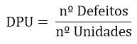

2. Defeitos por Oportunidade (DPO)
DPO são defeitos por oportunidade. Possui um conceito um pouco diferente de DPU, porque o que eu tenho que avaliar aqui é quantas oportunidades de defeitos eu tenho.

Continuando a usar o exemplo do formulário, você teria que pensar algo do tipo: quantas oportunidades de erros de preenchimento você tem nesse formulário?

Imagine que existam 3 oportunidades, as quais são: a pessoa deixar de marcar uma resposta, marcar mais de uma resposta para a mesma pergunta ou fazer um comentário no local errado.

Temos a seguinte fórmula para encontrar os DPOs:

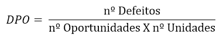

3. Defeito por milhão de oportunidades (DPMO)
O DPMO, defeito por milhão de oportunidades, é apenas uma forma diferente de ver o indicador DPO. A diferença é que aqui você vai multiplicar por um milhão.

Isso é muito usual porque muitas vezes estamos analisando uma empresa, uma fábrica, uma linha de produção de grande volume. Assim, é comum fazermos essa medição de contagem de defeitos, e essa medição ser feita em termos da ordem de grandeza de um milhão.

Geralmente as pessoas que trabalham com esse indicador falam da seguinte forma: eu possuo 20 defeitos por milhão ou 20 PPM, que seriam 20 partes por milhão.

4. Nível de qualidade Sigma
Chegamos enfim ao nível de qualidade Sigma! Esse nível sigma é uma forma que nós temos de avaliar a qualidade do processo.

No cálculo do nível Sigma você deve avaliar quantos defeitos ou quantos defeitos por oportunidade seu processo possui e traduzir isso para um nível de qualidade dentro da escala do nível Sigma.

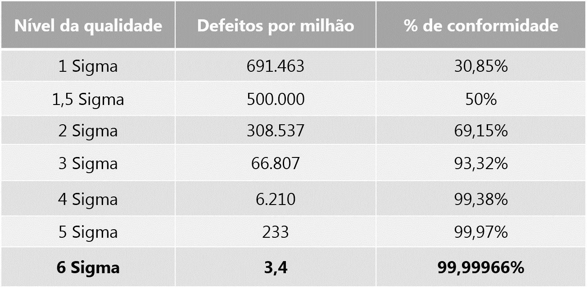

Reparou que a escala está em defeitos por milhão? É exatamente por isso que o DPMO tem uma forte relação com o nível de qualidade Sigma!

Ao encontrar os DPMOs, você pode avaliar seu resultado observando essa tabela. Assim, você saberá em qual nível de qualidade Sigma está seu processo, se é preciso melhorar ou se está satisfatório!

5. Diferença entre defeito e defeituoso
Em meio ao estudo desses indicadores, é importante ressaltar que existe uma diferença entre defeito e produto defeituoso. Vamos a eles?

Defeito: defeitos são falhas que você consegue medir na sua unidade de produto. Voltando ao exemplo do formulário... De forma simples, defeitos seriam os erros de preenchimento, pois são possíveis de se contar.
Defeituoso: Defeituoso é qualquer unidade de produto que possui um ou mais defeitos. Remetendo ao nosso exemplo, se seu formulário tem um ou dois erros de preenchimento, cada erro desse é um defeito. A partir do momento que esse formulário possuir um ou mais defeitos, você pode classificá-lo como um produto defeituoso.
Ficou claro a diferença? É muito importante entender essa diferença, porque normalmente nas ferramentas estatísticas medimos essas duas coisas separadamente.

Uma coisa é quantos itens defeituosos você tem, por exemplo, cinco formulários defeituosos. Porém cada formulário pode ter um ou mais defeitos, ou seja, um ou mais erros de preenchimento.

Então, à vezes nesses cinco formulários defeituosos, você pode ter 10, 15 ou 20 defeitos. Assim, você deve fazer essa contagem para que possa fazer a medição de forma separada.

6. COPQ (Cost of Poor Quality)
O custo da falta de qualidade se refere ao valor que você perde por não ter um bom nível de qualidade. Está relacionado a todas as perdas que você tem quando não se preocupa em como o seu processo está fluindo.

Por exemplo, imagine que você produz 100 mil garrafas de agua por dia, porém 30 mil são defeituosas, ou seja, você não pode vender. O custo dessas 30 mil garrafas é esse custo pela falta de qualidade, o custo de estar produzindo defeitos, utilizando um processo que não é otimizado, que não é estabilizado.

###

#### Conceitos de Qualidade

- E o que é Design for Six Sigma (DFSS)?
O Lean Six Sigma tenta corrigir processos quebrados que já existem. Mas e se houvesse uma maneira de criar processos de maior qualidade no estágio de projeto? Uma variante do Seis Sigma, o Design For Six Sigma (DFSS) é uma metodologia usada para projetar do zero ou reprojetar um produto ou processo. Dessa forma, seu objetivo é atender os requisitos do cliente e ter um nível de qualidade esperado do Seis Sigma. Produzir um nível tão baixo de defeitos a partir do lançamento de produtos ou serviços significa, por tanto, que deve-se compreender em si todas as expectativas e necessidades do cliente (CTQs). E é essencial que isso ocorra antes que um projeto possa ser concluído e implementado. DFSS é sobre "acertar na primeira vez" em vez de melhorar mais tarde (o foco do DMAIC Six Sigma). Esse, por fim, é o ponto em que o custo da mudança é menor e a facilidade de implementação é a mais alta. Design para Lean Six Sigma (DFLSS)?

É aí que o Lean é adicionado ao mix, então são todas as ferramentas e técnicas juntas. Um número crescente de implantações está descrevendo seus esforços como DFLSS.
