#### ARTIGO<!--Obrigatorio-->

[LINUX](#) | [DEBIAN](#) | [TECNOLOGIA](#) | 
Por:<strong> Wagner Torres</strong> | Data: 23/09/2022

  

<h2 align="center">Instalado o linux Debian</h2>

### Como instalar o Debian 10

Diferente de algumas distribuições Linux, que até usam o Debian como sistema base, a ISO do Debian 10 não traz uma função de Live CD, ou seja, ele precisa ser instalado. Quem quiser testá-lo até pode optar por uma outra versão de sua ISO, que é um Live CD por este link, mas ela é diferente do que será exibido logo abaixo. Veja como prosseguir com a sua instalação:

1. Acesse o site do Debian e realize o download da última ISO disponibilizada;
Agora, faça o download do aplicativo Rufus, que será utilizado para colocar a ISO do Debian 10 em um pendrive;
No Rufus, clique em “Selecionar”, escolha a ISO do Debian e clique em “Iniciar”.

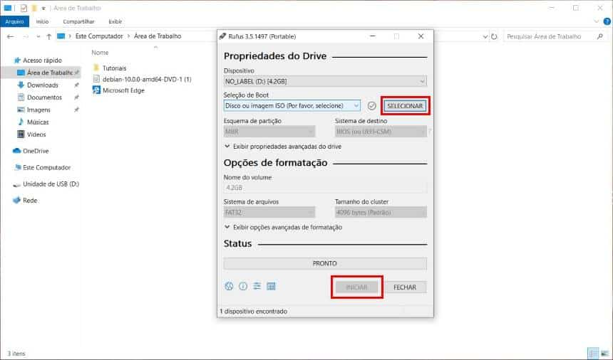

2. Agora que o pendrive está pronto, você já pode ir para o computador onde o Debian será instalado. Caso vá instalar o Debian 10 em uma máquina virtual, lembre-se de separar ao menos 32 GB de espaço para o seu HD Confira:

Ao ligar o computador, pressione repetidamente a tecla “Del” até que você esteja na BIOS do computador. Por lá, defina a ordem de boot para dar prioridade ao pendrive que está com a imagem do Debian. Esta etapa acaba variando de acordo com a marca de seu computador;
Após passar pela tela da BIOS, selecione a primeira opção, que é a “Graphical Install”;

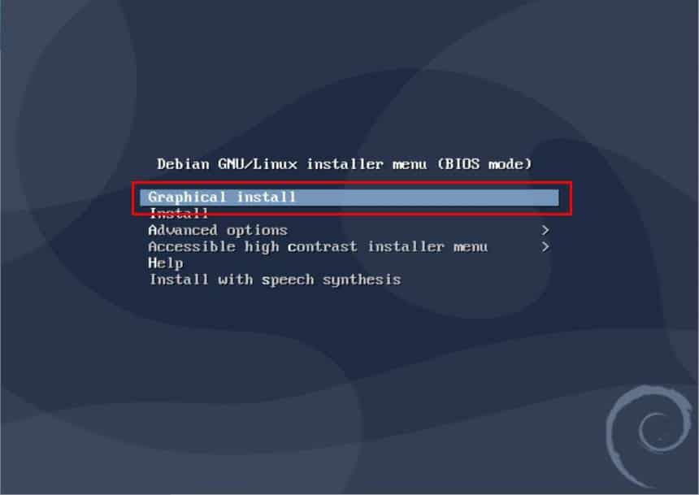

3. Então, selecione a opção de “Português do Brasil” para prosseguir e clique em “Continue”;

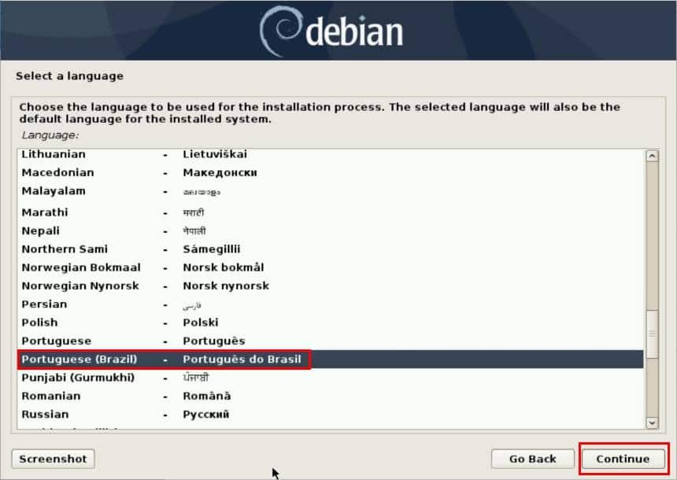

4. Na nova tela, mais uma vez, selecione a opção referente ao “Brasil” e clique em “Continuar”;

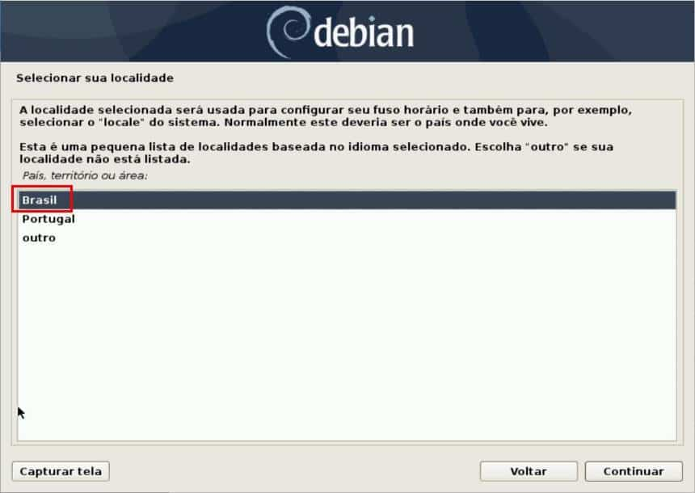

5. Agora, selecione o tipo de teclado a ser utilizado. Caso o seu contenha o “cedilha”, opte pela opção “Português Brasileiro”;

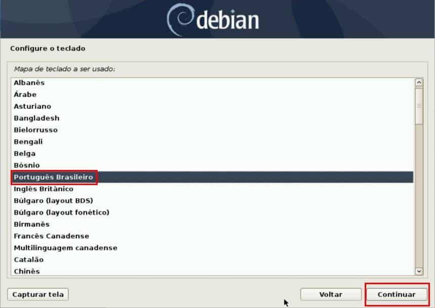

6. Aguarde até que o instalador do Debian carregue os seus componentes;
Na próxima tela, apenas clique em “Continuar”. Esta configuração é apenas para casos específicos e para máquinas em redes corporativas;
Defina um nome para a sua máquina. Caso você tenha mais de um computador em casa e eles estejam em rede, é recomendado que você dê um nome sugestivo para achá-lo depois com mais facilidade;

   

7. Caso esteja em algum domínio, coloque o nome dele agora para configurá-lo. Se não está em um domínio, basta clicar em “Continuar” e ignorar esta etapa;
Nesta tela, defina a senha do seu usuário root, que é como se fosse o “administrador” do Linux;

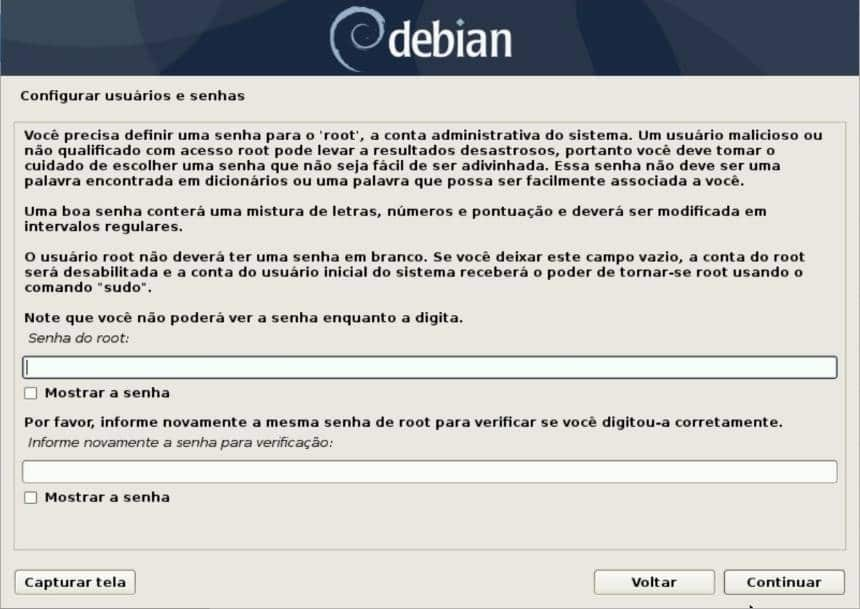

8. Após ter definido a senha, coloque o seu nome de verdade. Esta etapa ainda não é reeferente ao seu nome de usuário;

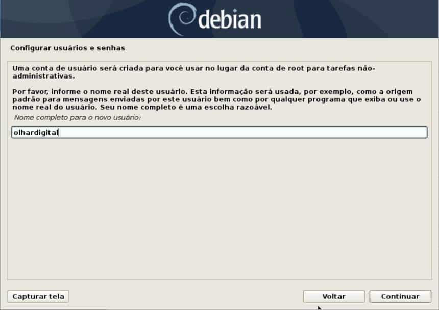

9. Agora, defina o nome de usuário. Ele será utilizado na sua pasta do sistema e para demais configurações a serem feitas dentro do Debian;

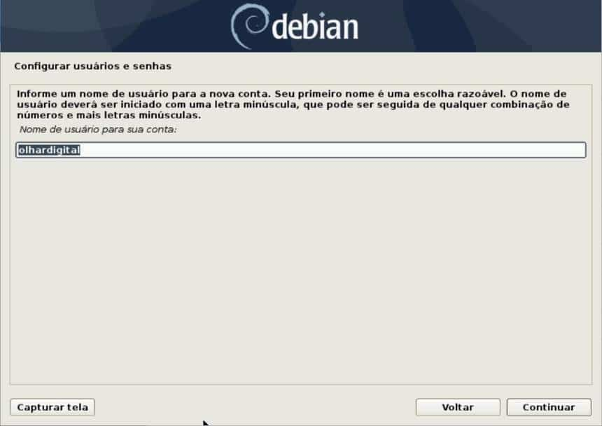

10. Assim como feito para o usuário root, defina uma senha para o seu usuário, que será o mais utilizado no dia a dia;

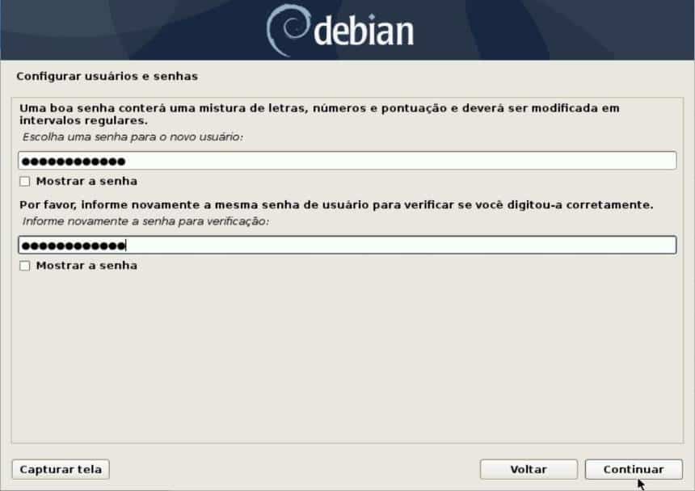

11. Selecione o seu estado ou província e clique em “Continuar” ;
Neste momento, você deverá escolher como particionar o seu HD. Em nosso caso, apenas o Debian será instalado nesta máquina e, por conta disto, será usada a opção “Assistido – usar o disco inteiro”. Caso você queira continuar com outro sistema, você deverá usar a opção “Manual” e particionar suas unidades de disco;

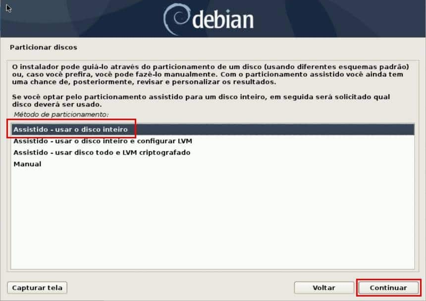

12. Verifique se o seu HD está listado corretamente, selecione-o e clique em “Continuar”;

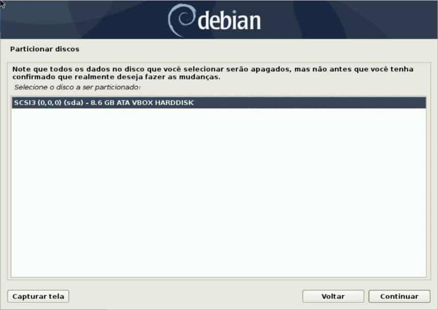

13. Na parte de “Particionar discos”, fica a seu critério manter todos os arquivos em uma partição só ou separar a pasta “/home” deles;

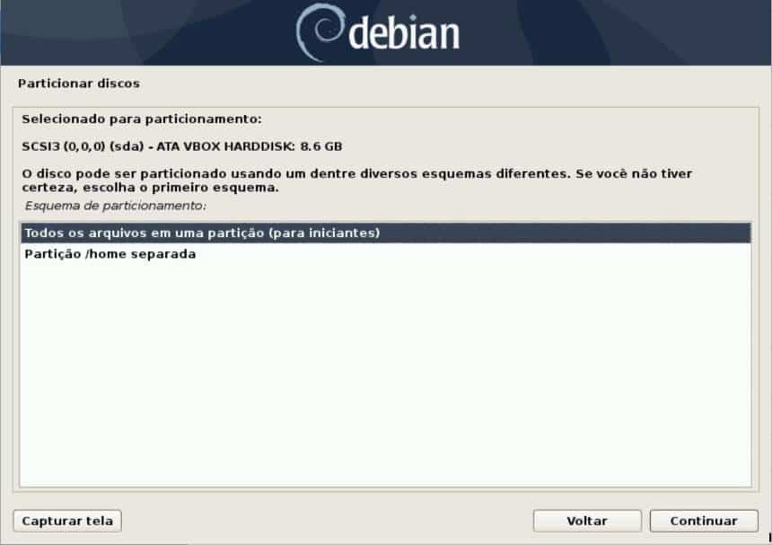

14. Confirme se todos os dados estão corretos e clique em “Continuar”;

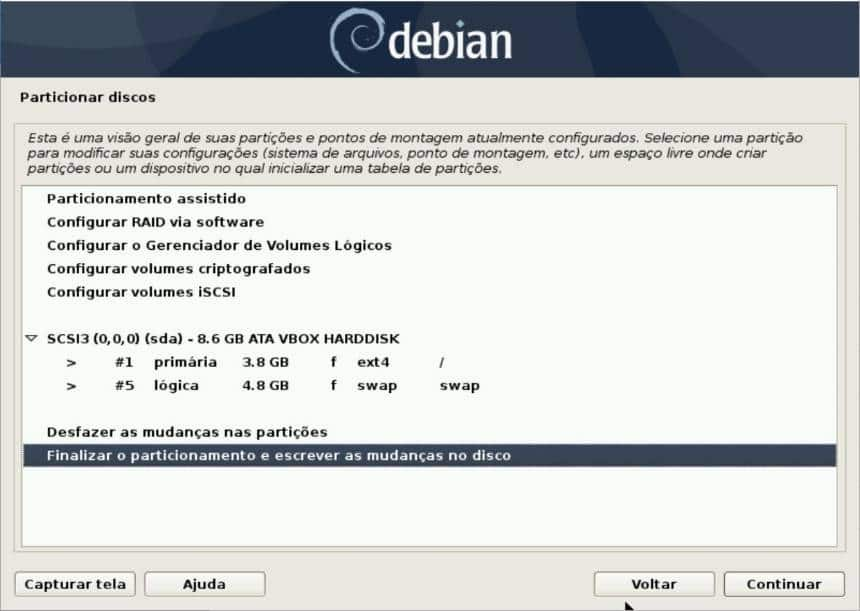

15. Marque a opção “Sim” e clique em “Continuar”;

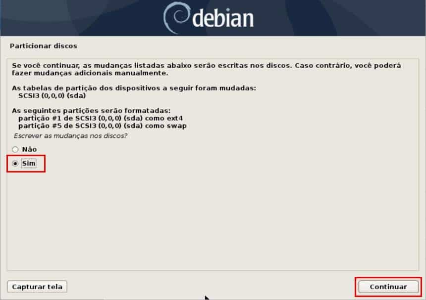

16. Aguarde até que a instalação do Debian seja completada.
Após completar a instalação do Debian, o seu instalador lhe perguntará se você deseja usar outros CDs ou DVDs para completar a sua instalação. Em nosso caso, utilizamos apenas o DVD de número 1, que já contém o básico, sendo que outros itens essenciais podem ser obtidos após a sua instalação. Então, seguem os demais passos para completar a instalação do sistema:

Marque a opção “Não” e clique em “Continuar”;

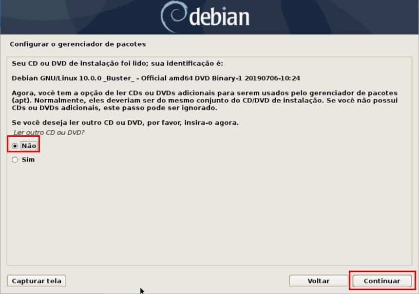

17. Agora, o Debian lhe pergunta se você deseja usar os “espelhos”, que na verdade são os seus mirrors com diversos programas. Marque a opção “Sim” e clique em “Continuar”;

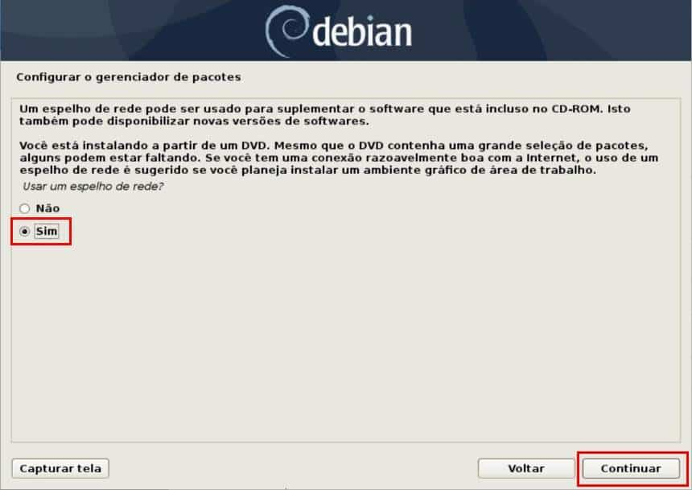

18. Selecione o “Brasil” e, na lista de repositórios, apenas clique mais uma vez em “Continuar”;
Caso utilize um proxy entre com os seus parâmetros ou pule esta etapa;
Na próxima tela, será perguntado se você deseja fazer parte do “concurso de utilização de pacote”, que serve para você enviar dados e ajudar no desenvolvimento dos apps. Fica a seu critério participar ou não deste programa;

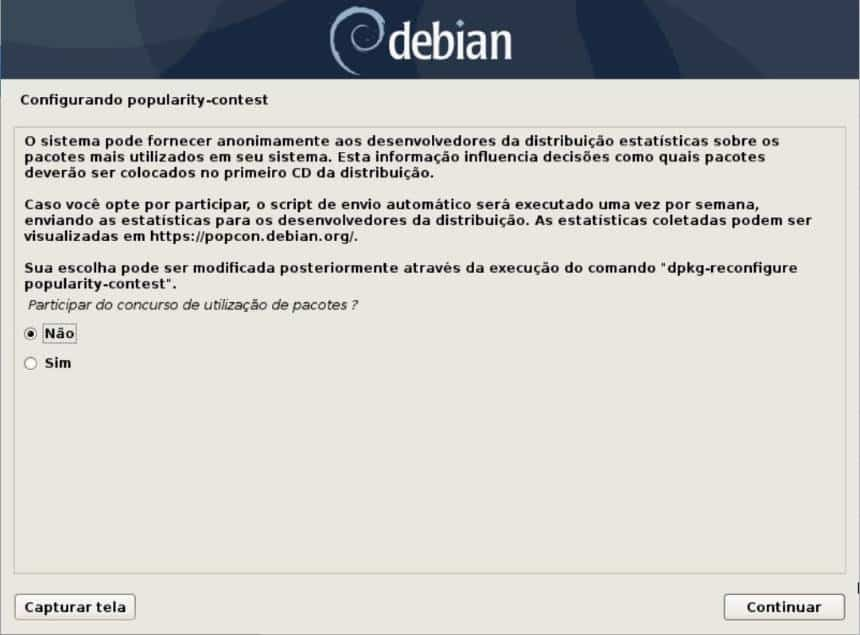

19. Selecione os pacotes que você deseja adicionar a sua instalação. Aqui, fica a sugestão de optar por um dos ambientes gráficos como o KDE Plasma, Gnome e outros. Para nossa instalação, optamos por ficar apenas com o KDE Plasma e o ambiente do próprio Debian;

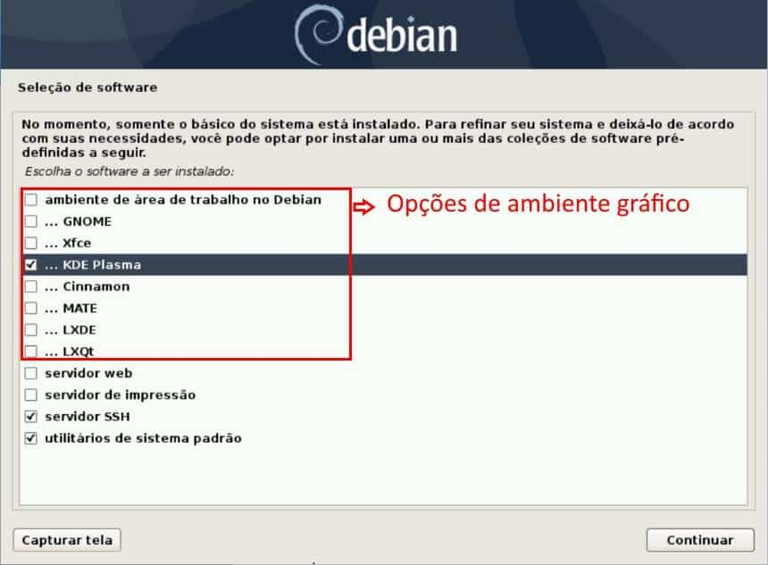

20. Na próxima tela, marque a opção “Sim” para instalar o Grub, que gerenciará o boot do sistema e clique em “Continuar”;

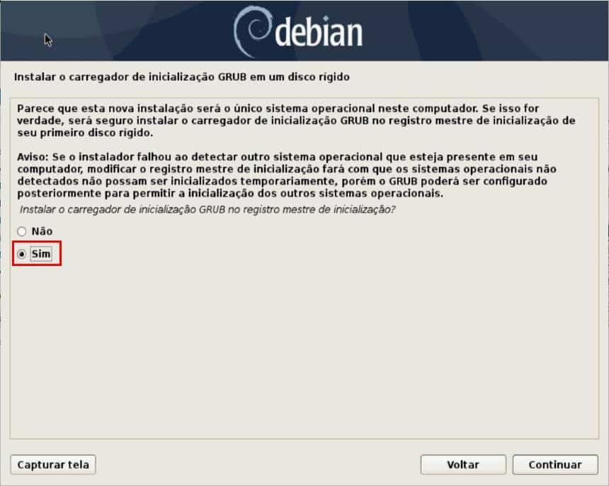

21. Já na nova tela, selecione o seu HD principal na lista e clique em “Continuar”;

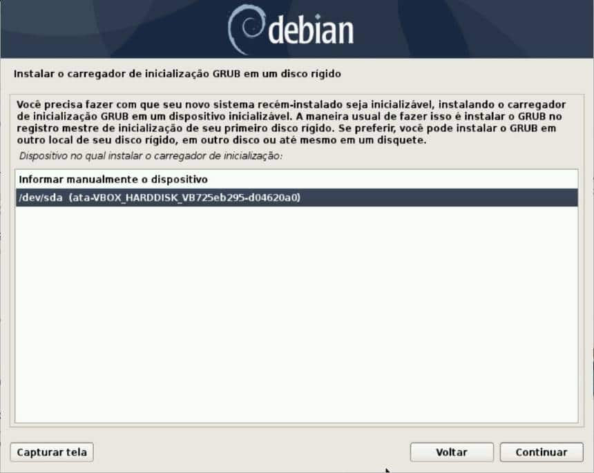

22. Por fim, retire o pendrive usado para fazer a instalação do Linux e, na BIOS do computador, selecione o HD para ter a prioridade de boot e reinicie a máquina.

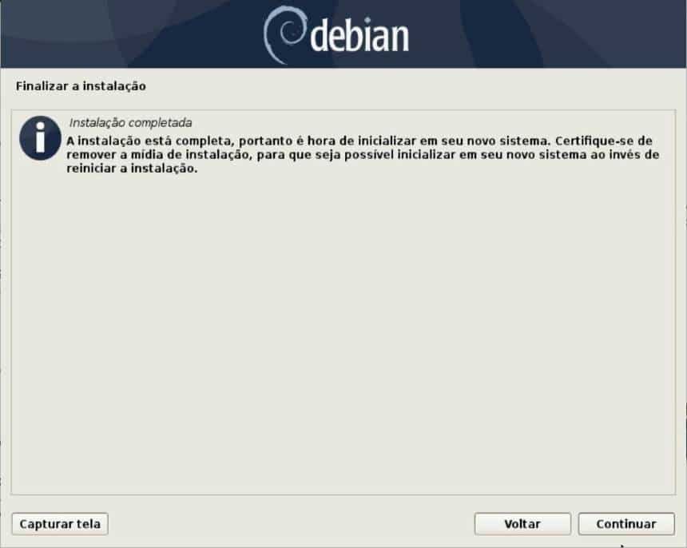

23. Agora que o sistema está instalado, após ligar o computador, basta escolher a primeira opção para entrar no Debian 10 na tela do Grub. Então, o sistema lhe pedirá a senha que você definiu para o seu usuário, que não é o root.

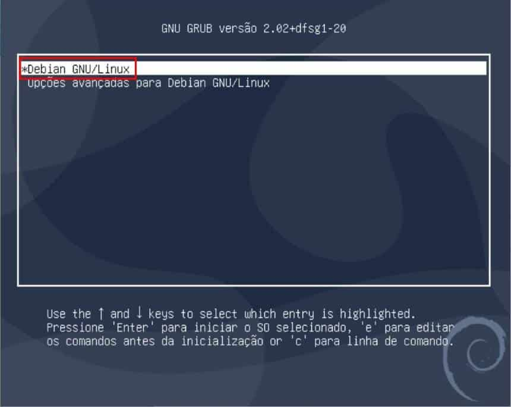

Pronto! Agora, você já sabe como instalar o Debian 10 em seu computador e quais são as suas principais novidades.