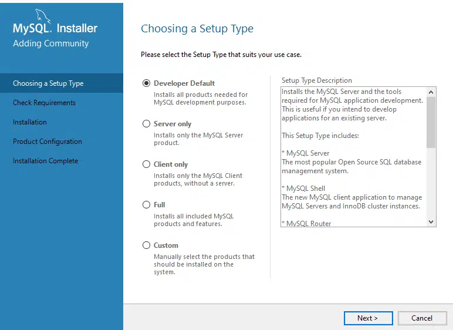

#### ARTIGO <!--Obrigatorio-->

[DATABASE](#) | [MySQL](#) | 
Por:<strong> Wagner Torres</strong> | Data: 23/09/2022

<h2 align="center">Implementação Data Base</h2>

 

### Instalando o MySQL e suas dependências:

O primeiro passo é instalar o MySQL. Para isso, acesse o site oficial da plataforma e na aba “downloads” clique em “MySQL Community (GPL) Downloads”. Então clique em “MySQL Community Server”. Nessa página, selecione o instalador adequado ao seu sistema operacional e faça download. 

Agora, siga com o passo a passo de instalação sugerido pelo programa do MySQL e clique na opção “Developer Default”. E então clique em “Next”. 

### Escolhendo o tipo de instalação do banco de dados MySQL

Caso você não possua as dependências necessárias para a instalação, o próprio programa vai listar quais são elas. 

1. Clicando no botão “Execute”, elas serão instaladas automaticamente. Finalizando esse processo, clique em “Next”. Na tela seguinte, clique em “Execute”, para que os programas do MySQL sejam de fato instalados.

2. Tela de instalação MySQL com componentes necessários para sua execução.

3. Finalizando a instalação, clique em “Next” nas próximas duas telas. Então o MySQL solicitará um método de autenticação. Selecione a primeira opção, para adicionar uma senha e clique em “Next”. Na próxima tela, crie uma senha forte e clique em “Next” nessa tela e nas próximas. 

4. Tela de instalação SQL com método de autenticação do banco de dados.

5. Definindo contas e papéis
Então, na tela abaixo clique em “Execute”, para que as últimas atualizações sejam aplicadas. Finalizado as instalações, o MySQL Workbench será iniciado, juntamente com seu servidor. Nesse programa ocorrerá todo o gerenciamento do banco de dados.

6. Tela de definição de configurações do banco de dados MySQL

### Criando um banco de dados simples

Agora, com o MySQL Workbench aberto, vamos clicar em “Local Instance” e informar a senha criada. Então, o painel de comandos irá se abrir. Você terá uma tela como a exibida abaixo.

Visão geral da ferramenta MySQL
Agora, para criar um banco, vamos usar o comando “create database”, seguido do nome do banco que desejamos criar. Então, na linha seguinte, informaremos o comando “use”, seguido do nome do banco criado, para que a plataforma saiba qual banco está em uso. Por fim, para executar os comandos informados, basta clicar no ícone de raio na lista de botões logo acima do terminal. 

### Criando banco de dados na tela inicial do MySQL

Na aba de “output”, logo abaixo do terminal, é possível consultar logs de sucesso e erros ocorridos no processo. Agora você já possui seu primeiro banco de dados criado. 

### Criando uma tabela, inserindo dados e visualizando o resultado
Vejamos então como criar uma tabela, inserir um registro e visualizar o dado criado. Para criar a tabela, usamos o comando “create table”, seguido do nome da tabela. Nesse exemplo, criaremos uma tabela com informações sobre clientes. 

Então, abrimos parênteses e adicionamos as colunas que desejamos. A primeira coluna será o id, usado para identificar o registro. Em seguida, criaremos uma coluna que conterá o nome do cliente. Com a tabela criada, clique no ícone de raio para executar o comando. Seu código deverá ser como o apresentado abaixo.

Código de criação da tabela em um banco de dados
Agora vamos inserir um registro, para isso, usaremos o comando “insert into”, seguido do nome da tabela. Então passaremos os valores que desejamos inserir. Como o campo de id possui o atributo “auto increment”, isso significa que esse valor será atribuído automaticamente, então iremos preencher apenas o campo de nome, como na imagem a seguir.

### Inserindo dados no banco de dados
Por fim, para visualizarmos a tabela com o dado inserido, usaremos o comando “select * from”, seguido do nome da tabela. Esse comando, por conter o símbolo “*”, trará todos os dados existentes na tabela.

### Inserindo dados no banco de dados e selecionando
O resultado desse comando será a tabela estrutura com linhas e colunas, contendo o dado inserido, como exibido abaixo.

O Resultado da criação da tabela deve aparecer no campo abaixo, desta forma concluimos a criação do banco.

_______________________________________

