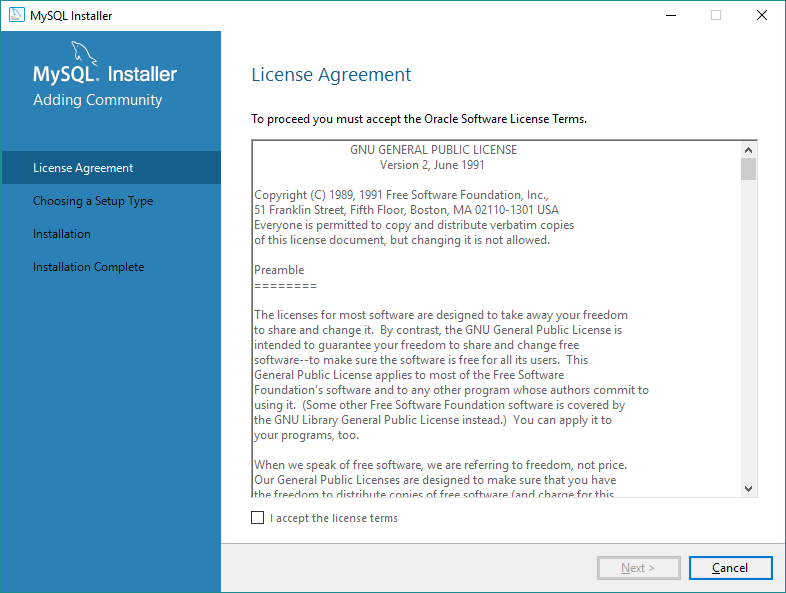

##### Tutorial <!--Obrigatorio-->

[WORKBENCH](#) | [MYSQL](#) | [DATABASE](#)  
Por:<strong> Wagner Torres</strong> | Data: 23/09/2022

## 
instalação do MySql Workbench no Windows

Como instalar o MySQL no Windows (Passo a passo!)

A página de Download pede login no site para fazer download. Mas tem um link para baixar sem fazer login. Você escolhe.

Login no site MySQL para baixar instalador
Faça o download para realizar a instalação. 

Após baixar o instalador do MySQL, execute-o. Ele te pedirá acesso de administrador.

Executar o instalador do MySQL.

Pode ser que o instalador identifique uma atualização e peça para ser atualizado, você pode escolher...

Eu preferi atualizar o instalador do MySQL. Neste caso ele vai baixar a atualização e em seguida iniciar o processo de instalação.

Atualização do instalador do MySQL

A primeira tela do instalador do MySQL pede para aceitar os termos de licença. Se concordar aceite (marcando o checkbox I accept the license terms) e clique em Next.

Tela de aceite de termos de licença do MySQL

Em seguida o instalador nos oferece 5 opções de instalação:

Padrão de desenvolvedor: inclui o servidor Mysql, ferramentas como Shell, Router e Workbench, conectores, etc.
Somente o servidor
Somente cliente: não instala o servidor MySQL
Completo: Tudo!
Personalizado
Eu sempre escolho personalizado pois nunca preciso de todos os conectores nem todas as ferramentas. E se precisar também, basta executar o instalador denovo e instalar o compoenente que eu precisar.

Escolha o que preferir e clique em Next >.

Seleção de tipo de instalação do MySQL

Se você, assim como eu, escolhou a opção de personalizar a instalação, você poderá escolher o que quer instalar.

Selecione o que quer instalar e clique na setinha para direita. Se quiser remover algum componete da instalação, selecione-o e clique na setinha para esquerda.

Escolha o que quer que seja instalado (o que ficará na lista da direita) e clique em Next >.

Tela de seleção de componentes do MySQL a serem instalado.

Na sequência o instalador deve verificar se falta alguma dependência para algum dos componentes selecionados para instalação.

No meu caso, o instalador identificou que eu não tinha o Visual C++ 2013 instalado.

Basta clicar em Execute que o instalador do Mysql baixa o instalador desta dependência e instala.

Instalador de dependência do MySQL

No meu caso o instalador do Visual C++ 2013 foi baixado e executado automaticamente. Bastou aceitar os termos e clicar em Install.

Após finalizar a instalação do Visual C++ 2013, o instalador do MySQL identifica que as dependências já estão resolvidas.

Se tiver mais de uma dependência para ser instalada no seu computador o instalador do MySQL não vai continuar enquando não atender os requisitos.

Quando as dependências estiverem devidamente instaladas, clique em Next >.

Dependências resolvidas para instalar o MySQL

Por fim, o instalador apresenta o que será baixado (se você escolheu o instalador mais leve que baixa o que precisa na hora da instalação) e instalado no seu computador. Se estiver tudo certo, clique em Execute.

Executar a instalação do MySQL

Agora o instalador vai baixar tudo que precisa (se precisar)...

Processo de download do MySQL

E instalar os componentes que você escolheu, um por um...

Processo de instalação do MySQL

Após todos os componentes estiverem instalados, clique em Next >.

Componentes do MySQL instalados.

Se você escolheu instalar algum componente que precisa de configuração como servidor SGBD MySQL, o instalador solicita que as configurações básicas sejam configuradas.

No meu caso era só o servidor MySQL que precisava de configuração. Clique em Next >.

Configuração dos componentes do MySQL

Para configurar o servidor do MySQL, o instalador oferece duas opções: Standalone ou Cluster.

Se você está configurando um servidor para desenvolvimento e não precisa trabalhar com "Cluster", escolha a primeira opção.

Após escolher a forma de replicação (Standalone ou Cluster) clique em Next >.

Forma de replicação do servidor MySQL - Standalone ou Cluster

Agora o instalador oferece algumas opções de configuração de rede e outras configurações. Se estiver instalando um servidor no seu computador para desenvolvimento, simplesmente aceite (ou troque a porta padrão do MySQL se for necessário, por causa de conflito) clicando em Next >.

Configuração de rede do MySQL

Na sequência, chega o momento de configurar a forma de acesso do usuário principal do SGBD MySQL.

Você pode escolher se quer um método de autenticação com senha encriptada (recomendado) ou o método antigo de autenticação.

Eu prefiro o mais seguro! =P

E se você for usar MySQL com versão 8.0 ou superior você precisará escolher esta opção.

Clique em Next após se decidir entre as duas opções.

Método de autenticação no MySQL

A tela seguinte pede para definirmos uma senha para o usuário root, ou seja, o usuário administrador.

A sua senha pode ser considerada fraca, média ou forte ... É bom usar uma senha complicada, mas você precisa lembrar dela! rs

Independente se você criar uma senha forte ou fraca, você poderá continuar com a instalação do MySQL. Mas é necessário que você digite a mesma senha, exatamente igual, nos dois campos apresentados. Clique em Next > para continuar.

Definição de senha para o MySQL

Seguindo o processo de instalação, nós podemos configurar se queremos que o servidor do MySQL seja gerenciado como um processo do Windows, se deve ser iniciado quando o sistema iniciar e sob qual usuário o processo do servidor do MySQL deve ser executado.

Eu prefiro que o servidor do MySQL seja executado como um serviço do Windows mesmo, iniciado junto com o Windows e sob o usuário padrão.

Após escolher, clique em Next >.

Modo de execução do MySQL no Windows

Para finalizar a configuração do MySQL, o instalador nos mostra um resumo do que será feito. Só precisamos clicar em Execute.

Aplicar configurações do MySQL

Após o processo de configuração terminar, basta clicar em Finish.

Finalizar configuração do servidor do MySQL

Por fim, você poderá copiar o log da instalação para a memória do seu computador e/ou iniciar algumas ferramentas de utilização do MySQL como o MySQL Workbench e o MysQL Shell.

Instalação do MySQL completa

Pronto! Tudo certo pra você começar a usar o MySQL no seu computador.